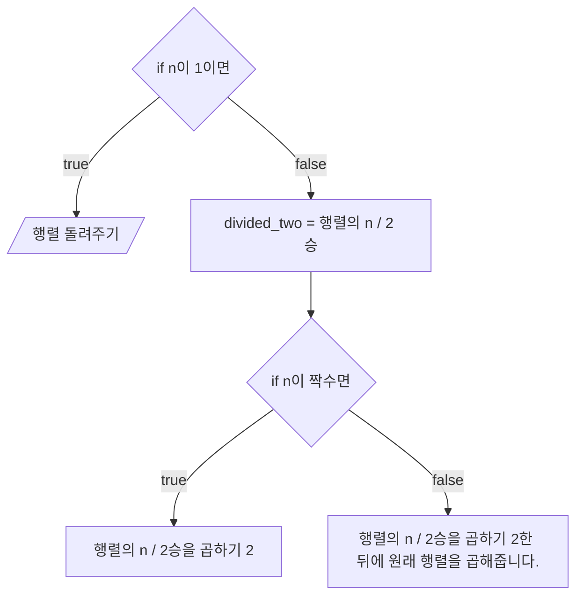

💳 문제이해

N * N 행렬(matrix)가 주어졌을 때, b만큼 곱해주세요.
곱할 때 각 원소를 1,000으로 나눈 나머지를 출력해주세요.

🚥 문제접근

행렬의 곱 b만큼 곱해줍니다. 즉 b의 제곱을 구하는 겁니다.

[행렬 곱셈](https://www.acmicpc.net/problem/2740) 선행 문제 풀이

행렬 곱셈에서 b만큼 더 돌리기엔, b의 최대 값이 10 x 10^11입니다. $O(N)$라고 해도,
매우 많이 시간 초과가
날 거 같습니다. 분할 정복 거듭제곱을 사용해서 시간 복잡도를 $O(log_2(N))$으로 줄입니다.

분할 정복 거드제곱의 규칙은 제곱이 짝수일 경우 현재 거듭제곱에서 2로 나눈 값을
두 번 곱합니다. 홀수 일 경우, 두번 곱한 값에서 본래 값을 한 번 더 곱해줍니다.

## 1️⃣  문제풀이

1. 메트릭스(행열)을 곱합니다.

<style>
    .grid-containers {
        display: flex;
        gap: 30px;
        margin: 20px
    }
    .grid-container {
        display: grid;
        grid-template-rows: repeat(2, 100px);
        grid-template-columns: repeat(2, 100px);
        grid-auto-flow: column;
        gap: 5px;

   }
    .arrow-1 {
      width:100px;
      height:30px;
      display: flex;
      align-self: center;
    }

   .arrow-1:before {
      content: "";
      background: currentColor;
      width:15px;
      clip-path: polygon(0 10px,calc(100% - 15px) 10px,calc(100% - 15px) 0,100% 50%,calc(100% - 15px) 100%,calc(100% - 15px) calc(100% - 10px),0 calc(100% - 10px));
      animation: a1 1.5s infinite linear;
    }

    @keyframes a1 {
      90%,100%{flex-grow: 1}
    }

   .box {
       background-color: gray;
       border-radius: 5px;
       display: flex;
       justify-content: center;
       align-item: center;
       color: black;
   }

   .small-grid-containers {
       display: flex;
       margin: 10px;
   }
    
    .small-grid-container {
       display: grid;
       grid-template-rows: repeat(2, 50px);
       grid-template-columns: repeat(2, 50px);
       gap: 10px;
       margin: 10px
   }

   .small-box {
       display: flex;
        background-color: gray; 
        border-radius: 5px;
   }

   .small-box-x {
       background-color: red;
   }

    .small-box-y {
        background-color: blue;
    }
</style>

<div class="grid-containers">
    <div class="grid-container">
        <span class="box">a11</span>
        <div class="box">a21</div>
        <div class="box">a12</div>
        <div class="box">a22</div>
    </div>
    <div style="align-self: center">x</div>
    <div class="grid-container">
        <span class="box">b11</span>
        <div class="box">b21</div>
        <div class="box">b12</div>
        <div class="box">b22</div>
    </div>
    <div class="arrow-1"></div>
    <div class="grid-container">
        <span class="box">(a11 * b11) + (a12 * b21)</span>
        <div class="box">(a21 * b11) + (a22 * b 21)</div>
        <div class="box">(a11 * b12) + (a12 * b22)</div>
        <div class="box">(a21 * b12) + (a22 * b22)</div>
    </div>
</div>

<div class="small-grid-containers">
    <div class="small-grid-container">
        <div class="small-box-y"></div>
        <div class="small-box-x"></div>
        <div class="small-box-x"></div>
        <div class="small-box"></div>
    </div>
    <div class="arrow-1"></div>
    <div class="small-grid-container">
        <div class="small-box-x"></div>
        <div class="small-box-y"></div>
        <div class="small-box"></div>
        <div class="small-box-x"></div>
    </div>
    <div class="arrow-1"></div>
    <div class="small-grid-container">
        <div class="small-box-x"></div>
        <div class="small-box"></div>
        <div class="small-box-y"></div>
        <div class="small-box-x"></div>
    </div>
    <div class="arrow-1"></div>
    <div class="small-grid-container">
        <div class="small-box"></div>
        <div class="small-box-x"></div>
        <div class="small-box-x"></div>
        <div class="small-box-y"></div>
    </div>
</div>

2. 분할 정복 거듭제곱을 사용하여 행렬 곱셈을 반복한다.



### source code 

```c
#include<stdio.h>
#include<stdint.h>
#include<stdlib.h>

typedef struct {
    int32_t n;
    int32_t** m;
} Matrix;

void initial_matrix(Matrix* a) {
    a->m = (int32_t**)malloc(a->n * sizeof(int32_t*));

    for (int32_t i = 0; i < a->n; i += 1) {
        a->m[i] = (int32_t*)malloc(a->n * sizeof(int32_t));
    }
    return;
}

void input_matrix(Matrix* a) {
    for (int32_t i = 0; i < a->n; i += 1) {
        for (int32_t j = 0; j < a->n; j += 1) {
            scanf("%d", &a->m[i][j]);
        }
    }

    return;
}

void print_matrix(Matrix a) {
    for (int32_t i = 0; i < a.n; i += 1) {
        for (int32_t j = 0; j < a.n; j += 1) {
            printf("%d ", a.m[i][j]);
        }
        printf("\n");
    }
}

Matrix multiple_matrix(Matrix a, Matrix b) {
    Matrix c = { a.n };
	initial_matrix(&c);
	
    for (int32_t i = 0; i < a.n; i += 1) {
        for (int32_t j = 0; j < b.n; j += 1) {
            c.m[i][j] = 0;
            for (int32_t k = 0; k < b.n; k += 1) {
                c.m[i][j] = (c.m[i][j] % 1000) + (((a.m[i][k] % 1000) * (b.m[k][j] % 1000)) % 1000)
					% 1000;
            }
			c.m[i][j] %= 1000;
        }
    }

    return c;
}

Matrix powerof_matrix(int64_t exponent, Matrix a) {
    if (exponent <= 1) {
		for (int32_t i = 0; i < a.n; i += 1) {
			for (int32_t j = 0; j < a.n; j += 1) {
				a.m[i][j] %= 1000;
			}
		}

		return a;
    } 

    Matrix k = powerof_matrix(exponent / 2, a);

	Matrix s = multiple_matrix(k, k);
    if (exponent % 2 == 0) {
		return s;
    } else {
		return multiple_matrix(s, a);
    }
}


int32_t main(void) {
    int32_t n;
	int64_t b;
    scanf("%d %ld", &n, &b);
    Matrix a; 

    a.n = n;
    initial_matrix(&a);
    input_matrix(&a);
    a = powerof_matrix(b, a);
    print_matrix(a);
    return 0;
}
```
