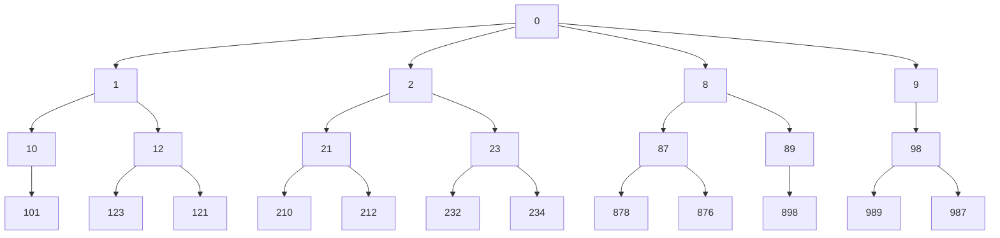

## Reflection

### 문제 내용
45656이란 수가 있다.

- 이 수는 인접한 모든 자리의 차이가 1 이다. 

N이 주어졌을 때, 길이가N인 계단 수가 총 몇 개 있는지 구해보자. 

> 이해가 잘 안돼서 예제를 적어봤다.

- 4 + 1 = 5
- 5 + 1 = 6
- 6 - 1 = 5
- 5 + 1 = 6
- 6 - 1 = 5
- ...

자릿수마다 1차이가 난다는 수가 계단 수라는 것은 이해했어요.

계단 수의 길이는 N. 그렇군요, 길이는 자릿수를 의미하는 거였어요.

어... 그러면 자릿수가 2일 경우 가능한 경우의 수는...

- 10, 12, 21, 23, 32, 34, 43, 45, 54, 56,
- 65, 67, 76, 78, 87, 89, 98

총 17개 

예제 입출력에서 나오는 답이랑 맞아요.

### 풀이
자릿수 9를 제의하고 10 이상의 자릿수는 경우의 수가 2개 이상이다.

- 10, 12, 21, 23 ... 98



아, 자릿수 0도 경우의 수가 1밖에 없네요.

- `DFS` 백트랙킹(backtracking) 재귀 함수로 풀 수 있을 거 같습니다.
- 다이내믹(Dynmaic) 프로그램 상 시간 초과 날 거 같아서, 
- 작은 케이스(sub problems)로 쪼개서 생각해볼게요..

1 ~ 8은 패턴이 반복적이에요
- 1의 다음 자릿수는 0, 2
- 2의 다음 자릿수는 1, 3
- 0과 9의 다음 자릿수는 1, 8

그렇다면 아래 케이스에서부터 경우의 수를 저장하면서, 마자막 자릿수까지 올라가면,
될 거 같아요. [bottom up]()

#### 🌩️ 로직
트리 형태에서, 저는 자주 사용하는 2차원 배열을 사용할 거에요.
1차원은 자릿수를, 2차원은 0~9의 계단 수를 저장 할 거에요.

1. 자릿수 1은 0을 제의하고 계단 수가  1이기 때문에, 1을 넣어줄 거에요.

```c
//자릿수 1에 1부터 9까지 1저장
for (int32_t index = 1; index < 10; index += 1) {
    stairs[0][index] = 1;
}

stairs[0][0] = 0;
```

2. 이제 각 자릿수마다, 0~9의 전 자릿수를 더하거나 할당할 거에요.

```c
int32_t length = N;
//1의 자릿수인 0은 이미 했어요.
for (int32_t digits = 1; digits < length; digits += 1) {
    for (int32_t number = 0; number < 10; number += 1) {
        if (number == 0) {
            stairs[digits][number] = stairs[digits - 1][number + 1];
        } else if (number == 9) {
            stairs[digits][number] = stairs[digits - 1][number - 1];
        } else {
            stairs[digits][number] = stairs[digits - 1][number - 1] +
                stairs[digits - 1][number + 1];
        }
    }
}
```

3. N의 계단 수를 다 구했으면, 이제 더하고 출력 조건에, 계단 수를 10억의 나머지를 출력하면 되요.

```c
int32_t sum = 0;

for (int32_t number = 0; number < 10; number += 1) {
    sum += stairs[N][number];
}

sum %= 1000000000;
```

⁉️ 근데 N이 최대 100이라는 건 `int` 32비트로는 최대 수가 만족 되지 않기 때문에 오버플로(overflow)가 일어날 가능성이 있습니다.

- 저희가 최종적으로 구하는 건 10억의 나머지. 이 뜻은 10억을 초과한 숫자는 필요 없다는 거에요.
- 부호 있는 `int` 32비트는 ${2 ^{31}} - 1$ = 21억... 
- 10억 이하는 감당 할 수 있어요. 

4. 수정
```c
for (int32_t digits = 1; digits < length; digits += 1) {
    for (int32_t number = 0; number < 10; number += 1) {
        if (number == 0) {
            stairs[digits][number] = stairs[digits - 1][number + 1];
        } else if (number == 9) {
            stairs[digits][number] = stairs[digits - 1][number - 1];
        } else {
            stairs[digits][number] = stairs[digits - 1][number - 1] +
                stairs[digits - 1][number + 1];
        }
        //10억 이하만 구해요.
        stairs[digits][number] %= 1000000000;
    }
}
```

#### 결론
시간복잡도는 2중 for문을 사용해서, $O(N \times 10)$, 공간 복잡도도 마찬가지로,
$O(N \times 10)$ 할 거에요. 완전탐색 `DFS`를 사용하면, `Gemini` 말로는 시간복잡도가 
$O(10^N)$ 소요 되어서 비효율적이라고 하네요.

- 시간복잡도: $O(N \times 10)$;
- 공간복잡도: $O(N \times 10)$;

