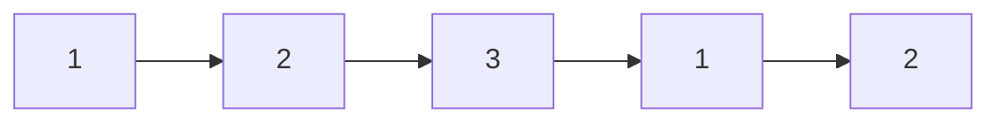
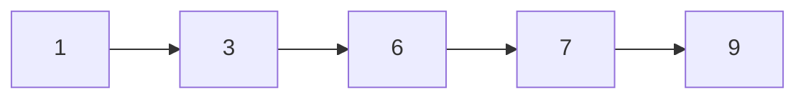
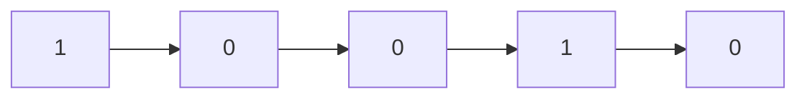

# Reflection

## 💳 문제풀이

n개의 정수 수열이 주어졌을 때, `M`으로 나누어 떨어지는 연속된 수열의 개수를 구하세요.

## 🚥 문제접근

수열의 각 원소마다 연속적으로 뒤에 원소와 계산하면 시간복잡도는 $O(n^2)$로 비효율적이므로

DP의 특징인 작은 케이스부터 계산하여 풀어가는 식으로 풀겠습니다.


### 1️⃣  문제풀이

누적합 수열(prefix sum)을 계산합니다.

- 첫번째 원소부터 시작하여, 마지막 원소까지의 합을 구합니다.
- 누접합 수열 각 원소에서 `M`으로 나누어지는지에 대해 여부를 새로운 배열에 저장합니다.

**예시**:



**누계합:**



**나누어떨어지는 원소의 나머지**:


- [ ] 여기서 `나누어떨어지는 원소의 배열`(나머지 배열)을 통해 구간 개수가 최소 6개인 건 알 수 있습니다.

1. 3은 M으로 나누어떨어지기 때문에 개수가 증가합니다
2. 6은 M으로 나누어떨어지기 때문에 개수가 증가합니다.
3. 9은 M으로 나누어떨어지기 때문에 개수가 증가합니다.
4. 3 + 6 은 M으로 나누어떨어지기 때문에 개수가 증가합니다.
5. 3 + 6 + 9 은 M으로 나누어떨어지기 때문에 개수가 증가합니다.
6. 6 + 9 은 M으로 나누어떨어지기 때문에 개수가 증가합니다.

4, 5, 6의 경우 `Combination`을 사용하여 [i, j]의 경우의 수를 구할 수 있습니다.

**Combination**, 순번 상관 없이 n개 에서 r개를 뽑아서 나오는 경우의 수

**조합(combination)공식**:
$$_nC_r = \frac{n!}{r!(n - r)!}$$

다만 r이 2로 고정이면, 다음과 같이 조합의 간소화된 형태를 사용 할 수 있습니다.

$$Combination(n, 2) = \frac{n \cdot (n - 1)}{r}$$

- n은 2(3), 3(6), 5(9)이므로 3개
- r은 구간 [i, j]를 뽑으므로 2개

- $_3C_2 = 3$

경우의 수:
1. [2, 3] = 3 + 6
2. [2, 5] = 3 + 6 + 9
3. [3, 6] = 6 + 9

그리고 별도로 3, 6, 9 단일 구간은 별도로 더합니다.

4. [2, 2] = 3
5. [3, 3] = 6
6. [5, 5] = 9

결과적으로 구간 개수 6개를 구할 수 있습니다.

하지만 구간[2, 4] = 2 + 3 + 1 = 6, 도 M(3) 나누어 떨어집니다.

이게 가능한 이유는 첫번째 요소의 나머지가 1이기 때문에, 
2 + 3 다음 요소인 1로 대체가 가능하다는 점입니다.

이처럼 나머지 수가 많을 경우 추가 연속 부분 구간이 생길 수 있으므로 

이 또한 `Combination`을 사용해 처리해줍니다.

n = 나머지 1인 경우는 2개
r = [i, j] 구간을 구하므로 2개

- $Combination(2, 2)$ = 1 

1을 더해주면 7 

그러므로 M으로 나누어 떨어지는 연속 부분 구간의 개수는 7입니다.

```py
import sys;

inputed: str = str(sys.stdin.readline().rstrip().split());
n: int = int(inputed[0]);
M: int = int(inputed[1]);

inputed: str = str(sys.stdin.readline().rstrip().split());

sequence: list[int] = [0 for num in range(0, n)];

prefix_sum: list[int] = [0 for num in range(0, n)];

prefix_sum[0] = sequence[0];

for index in range(1, n):
    prefix_sum[index] = prefix_sum[index - 1] + sequenceindex];

modular_sequence: list[int] = [0 for num in range(0, n)];

for index in range(0, n):
    modular_sequence[prefix_sum[index] % M] += 1;

count: int = modular_sequence[0];

def combination(n, r):
    return (n * (n - 1) / r);

for index in range(0, M):
    count += combination(modular_sequence[index], 2);

print(count);
```
