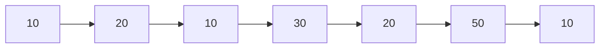
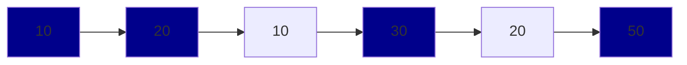

# Reflection

## 💳 문제이해

주어진 수열에서 좌에서 우로 오름차순으로 커지는 수열에서 최대 원소에 길이를 구합니다.(출력)


수열:


예시: 가장 긴 수열의 길이는 `4`: 

수열을 한개부터 시작해서 쪼개서 생각해볼 겁니다.

순번(order) | 최대 길이 | 패턴
---:|:---:|:---
1 | 1 | 10 
2 | 2 | 10 -> 20
3 | 2 | 10 -> 20
4 | 3 | 10 -> 20 -> 30
5 | 3 | 10 -> 20 -> 30
6 | 4 | 10 -> 20 -> 30 -> 50



### 1️⃣ 첫번째 풀이

좌측에서 시작하는 숫자가 작거나, 마지막 숫자가 클수록 사이에 들어갈 있는 수의 길이가
증가합니다.

그러면 경우의 수를 따져 발생할 수 있는 케이스들을 찾아봅니다.

1. 뒤의 원소가 앞의 원소보다 클 경우 길이가 증감합니다.
- 1 --> 2 --> 3
- 길이는 3

2. 반대로 뒤의 원소가 앞의 원소보다 작을 경우, 오름차순 길이가 증가하지 않습니다.
- 6 --> 7 --> 8 --> 1 --> 2 --> 3 --> 4
- 하지만 저희는 1이 이 수열에서 가장 **작은** 수라는 것을 알고 있습니다.
- 이는 시작 숫자가 작은 수일수록 오름차순 길이가 증가할 확률이 높습니다.

순차적으로 돌아봅시다: 
- 8 입장에서 본인 포함하여 가장 긴 길이는 3입니다.

여기서부터 1보다 작은 수가 있는지 여부에 대하여, 첫번째 원소부터 순차적으로 탐색할 것입니다.

1. 6 x
2. 7 x
3. 8 x

없습니다. 고로 1의 최대 길이는 본인 한개입니다.

다음 요소입니다, 2또한 같은 방법을 사용하여 확인합니다.
1 이 2보다 작기 때문에. 1 과 2를 포함하여 2의 최대 길이는 2입니다.

같은 로직을 마지막 원소까지 반복합니다.

1. 3의 최대길이 = 3 이하 원소의 최대 길이 = 2 + 1 = 3
2. 4의 최대길이 = 3의 최대길이 + 1 = 3 + 1 = 4

전체 탐색이 끝났으면, 각 원소의 최대 길이중 최대 값을 구합니다.

### 📔 코드 구현

```c
//c 언어
int32_t get_longest_increasing_subsequence(int32_t sequence[], int32_t length)  {
    int32_t return_value = 0;

    int32_t dp[length];
    dp[0] = 1;

    for (int32_t index = 1; index < length; index += 1) {
        // 본인 길이 1 초기화
        dp[index] = 1;
        for (int32_t index_j = 0; index_j < index; index_j += 1) {
            // 본인 값보다 작을 경우 
            if (sequence[index] > sequence[index_j]) {
                // 본인 길이(1)보다 클 경우 할당.
                dp[index] = dp[index] > dp[index_j] + 1 ?
                    dp[index] : dp[index_j] + 1;
            }
        }
    } 

    int32_t max_length = dp[0];
    for (int32_t index = 1; index < length; index += 1) {
        // 최대 길이보다 크면 최대 길이 갱신
        if (dp[index] > max_length) {
            max_length = dp[index];
        }
    }
    
    return_value = max_length;

    return return_value;
}
```

### ⏰ 알고리즘 복잡도
- 시간 복잡도(time complexity): $O(n^2)$
    - 최악의 경우 2중 중첩 for문이 n번 실행됩니다.
- 공간 복잡도(space complexity): $O(n)$
    - 최대 공간 수는 dp 배열 길이인 n입니다.


## ref:
- [백준/11054](https://www.acmicpc.net/problem/11054)
