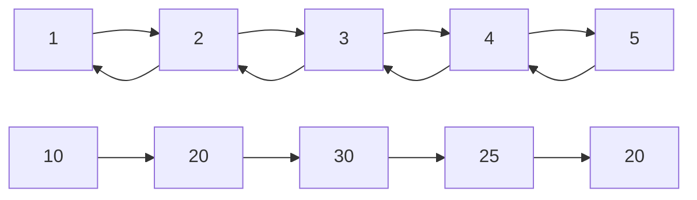
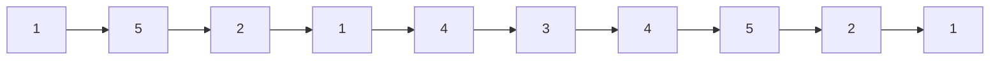

# Reflection

## 💳 문제이해

> 수열 S가 어떤 수 $S_k$를 기준으로 $S_1 < S_2 < ... S_k > S_{k + 1} > ... S_{N + 1}
S_{N}$을 만족한다면, 그 수열은 바이토닉 수열이라고 한다.

**바이토닉 수열**:


주어진 수열에서 바이토닉 수열에 조건을 만족하는 부분 수열의 최대 길이 구하기.

## 🚥 문제접근
- 이는 동적 프로그래밍(dynamic programming)입니다.
- 문제[11054](06-DAILY/TIL/algorithm/1723864771-MPAR.md)는 $S_k$ 까지의 길이를
구하지만, 이 문제는 $S_k$ 이하의 수들 또한 길이의 포함됩니다.
- 풀고 오세요


해당 문제는 작은 케이스들 저장하여, 전 원소의 최대 길이를 조회하여 현제 원소의 최대 길이를
더 하는 식의 방법을 사용했습니다.

그러면 이번에는 $S_k$ 다음 원소를 탐색하면 될 거 같습니다.

### 1️⃣  첫번째 풀이

문제 `11054`에서는 $S_1에서S_k$까지 탐색했지만, 반대로 $S_n 부터 S_k 까지$ 탐색
하면 될 거 같습니다.



좌에서 우로, 우에서 좌로 탐색한 최대 길이를 구하고

그 다음에 각 수열에서 각 원소의 최대 길이를 더하고 1(본인 원소 중복이기 때문에 하나 뺍니다.)을 빼면 될 거 같습니다.

#### 📕 소스코드
```c
#define get_max_ab(a, b)(a > b ? a : b)

// 좌에서 우 오름차순으로 각 원소의 최대 길이 구하기
int32_t* get_longest_increasing_subsequence(int32_t sequence[], int32_t length) {
    int32_t return_value = NULL;

    int32_t* dp = (int32_t*)malloc(length * sizeof(int32));
    dp[0] = 1;
    
    for (int32_t index_j = 1; index_j < length; index_j += 1) {
        for (int32_t index_k = 0; index_k < index_j; index_k += 1) {
            if (sequence[index_j] > sequence[index_k]) {
                int32_t a = dp[index_j];
                int32_t b = dp[index_k];
                dp[index_j] = get_max_ab(a, b);
            }
        }
    }
    
    return_value = dp;
    return return_value;
}


// 우에서 좌 오름차순으로 각 원소의 최대 길이 구하기
int32_t* get_longest_decreasing_subsequence(int32_t sequence[], int32_t length) {
    int32_t return_value = NULL;

    int32_t* dp = (int32_t*)malloc(length * sizeof(int32));
    dp[lenth - 1] = 1;
    
    for (int32_t index_j = length - 2; index_j >= 0 ; index_j -= 1) {
        for (int32_t index_k = length - 1; index_k > index_j; index_k -= 1) {
            if (sequence[index_j] > sequence[index_k]) {
                int32_t a = dp[index_j];
                int32_t b = dp[index_k];
                dp[index_j] = get_max_ab(a, b);
            }
        }
    }
    
    return_value = dp;
    return return_value;
}

int32_t get_max_length(int32_t[] dp1, int32_t[] dp2, int32_t length) {
    int32_t return_value = 0;
    int32_t dp[length];

    dp[0] = 1;

    for (int32_t index_j = 0; index_j < length - 1; index_j += 1) {
        for (int32_t index_k = 0; index_k < index_j; index_k += 1) {
            // 각 dp마다 최대길이에 본인 원소가 중복 포함이라서 하나 빼야 합니다.
            dp[index] = dp1[index] + dp2[index] + 1;
        }
    }
    
    // 최대 길이 구하기
    int32_t max_length = dp[0];
    for (int32_t index = 1; index < length; index += 1) {
        if (dp[index] > max_length) {
            max_length = dp[index];
        }
    } 

    return_value = max_length;
    return return_value;
}
```
