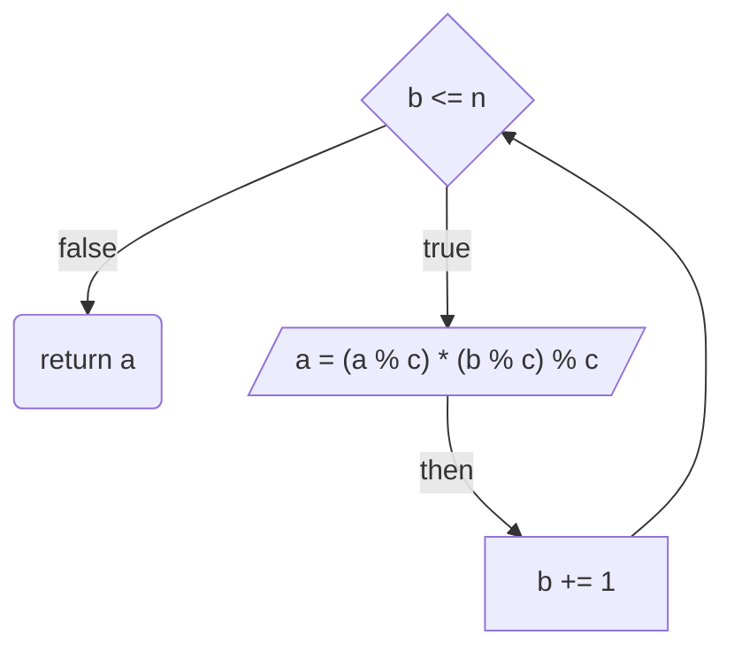
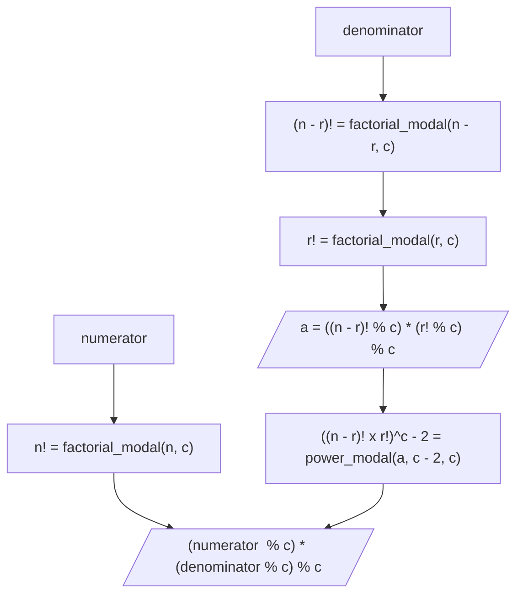

# 💳 문제이해

N과 M이 주어졌을 때 N과 M의 이항 계수(binomial coefficient)를 구한 값에서
1,000,000,007 나눈 나머지를 구하세요.


# 🚥 문제접근
이항 계수(binomial coefficient)는 조합(combination)의 다른 이름입니다.

- 공식:


$$_nC_r = \frac{n!}{(n - r)! \times r!}$$

modular rules:

- addition
    - (a + b) % c = (a % c) + (b % c) % c
- subtraction
    - (a - b) % c = (a % c) - (b % c) % c
- multiplication
    - (a * b) %c = (a % c) * (b % c) % c
- division
    - a 와 b의 나누기는 없습니다.

페르마 소정리를 통해 제곱의 나머지를 구할 수 있지만,제수(divisor)가 `소수`라는 전제하에
가능합니다.. 다행히 제수(divisor)는 1,000,000,007 소수입니다.

페르마 소정리:

$a^p \equiv a(mod)p$

이는 문장으로 하면 "a^p는 a와 p가 나눈 나머지가 같다." 또는 "a는 b와 p에 대해 합동이다."
("a is congruent to b modulo p")

양변에 $a^2$를 나눈다.

$a^{p - 2} \equiv \frac{1}{a}$

$$ _nC_r = \frac{n!}{(n - r)! \times r!} = (n! \% p)((n-r)!(r!))^{p - 2} \% p$$

팩토리얼은 모듈러 곱셈 규칙을 사용해 각 연산마다 나머지를 구한 뒤에 계속 구하면
될 거 같습니다.

분할 정복 거듭제곱을 사용해서 구하면 될 거 같습니다.

## 1️⃣  문제풀이

```
//input
5 2

```

### 1. 분모인(n! % c)를 구합니다.

팩토리얼 모듈러 버전

1. a = (1 % c) * (2 % c) % c
2. a = (2 % c) * (3 % c) % c
3. a = (6 % c) * (4 % c) % c
4. a = (24 % c) * (5 % c) % c
5. a = 120 

### 2. 분자인 (((n - r)! r!)$^{c - 2}$)를 구합니다.

1. 팩토리얼 모듈러를 사용해 괄호 안에 제곱을 제외한
연산을 모두 수행합니다.

2. 분할 정복 제곱을 사용해 $a^{c - 2}$값을 구합니다.

3. 모듈러 곱셈 규칙을 사용하여 분모를 구합니다.

4. 마찬가지로, 모듈러 곱셈 규칙을 사용하여 분모와 분자에 곱한 수의
1,000,000,007를 나눈 나머지를 구합니다.



## ref
- [이항계수3](https://www.acmicpc.net/problem/11401)
- [참고](https://velog.io/@ledcost/%EB%B0%B1%EC%A4%80-11401-%ED%8C%8C%EC%9D%B4%EC%8D%AC-%EC%9D%B4%ED%95%AD-%EA%B3%84%EC%88%98-3-%EA%B3%A8%EB%93%9C1-%EB%B6%84%ED%95%A0-%EC%A0%95%EB%B3%B5)
