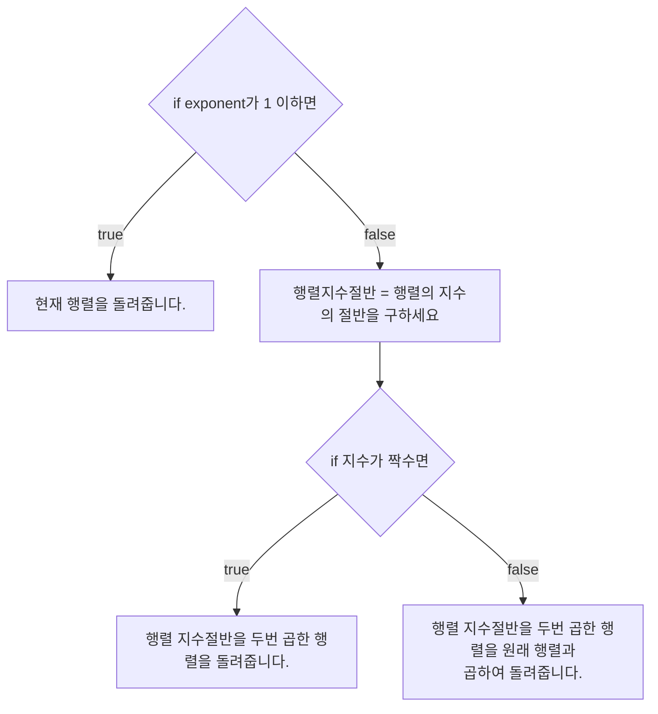

# 💳 문제이해

N이 최대 10 x 10^19 주어졌을 때 피보나치 수 N을 구하세요.k

# 🚥 문제접근

일반 dp를 사용한 피보나치 수열을 구하는 방법은
시간 복잡도 $O(N)$를 기록하여 오래 걸리므로 분할을 하든 패턴을 찾든 해서, 
실행 시간을 줄여야 합니다.

n | fibonacci(n)
:---:|:---:
0 | 0
1 | 1
2 | 1
3 | 2
4 | 3
5 | 5
6 | 8
7 | 13 
8 | 21
9 | 34
10 | 55

위에 과정에서 패턴을 찾아야 합니다.
모르겠어서 gpt한테 물어봤습니다.

피보나치 수열의 공식은:
$$F(n) = F(n - 1) + F(n - 2)$$

이를 행렬로 표현하면 이렇습니다.

$$
\begin{pmatrix}
F(n) \\
F(n-1)
\end{pmatrix}
=
\begin{pmatrix}
1 & 1 \\
1 & 0
\end{pmatrix}^{n-1}
\begin{pmatrix}
F(1) \\
F(0)
\end{pmatrix}
$$

행렬 거듭제곱을 사용하면 풀 수 있습니다.

## 1️⃣  문제풀이

1. 행렬 거듭제곱을 구합니다.



2. 행렬 곱하기

<style>
    .arrow {
        height: 0;
        border-style: solid;
        border-top: 5px solid transparent;
        border-bottom: 5px solid transparent;
        border-left: 10px solid #555555;
        border-right: 0;
    }
    .grid-background {
        display: flex;
        justify-content: center;
        align-items: center;
        margin: 10px;
        width: 105%;

        background-color: white;
    }
    .grid-container {
        display: grid;
        grid-template-rows: repeat(4, 20px);
        grid-template-columns: repeat(4, 20px);
        gap: 2px;
        border-radius: 5px;
        margin: 10px
    }

    .box {
        display: flex;
        justify-content: center;
        align-items: center;
        border-radius: 5px;
        width: 100%;
        height: 100%;
        border: solid;
        font-size: 10px;
        color: black;

    }
    
    .box-gray {
        background-color: gray;
    }

    .box-black {
        background-color: black;
    }

    .box-yellow {
        background-color: yellow;
    }
</style>

<div class="grid-background">
<div class="grid-container">    
    <div class="box box-yellow">1/1</div>
    <div class="box box-gray">1/2</div>
    <div class="box box-gray">1/3</div>
    <div class="box box-gray">1/4</div>
    <div class="box box-gray">2/1</div>
    <div class="box box-black"></div>
    <div class="box box-black"></div>
    <div class="box box-black"></div>
    <div class="box box-gray">3/1</div>
    <div class="box box-black"></div>
    <div class="box box-black"></div>
    <div class="box box-black"></div>
    <div class="box box-gray">4/1</div>
    <div class="box box-black"></div>
    <div class="box box-black"></div>
    <div class="box box-black"></div>
</div>
<div class="arrow"></div>
<div class="grid-container">    
    <div class="box box-gray"></div>
    <div class="box box-yellow"></div>
    <div class="box box-gray"></div>
    <div class="box box-gray"></div>
    <div class="box box-black"></div>
    <div class="box box-gray"></div>
    <div class="box box-black"></div>
    <div class="box box-black"></div>
    <div class="box box-black"></div>
    <div class="box box-gray"></div>
    <div class="box box-black"></div>
    <div class="box box-black"></div>
    <div class="box box-black"></div>
    <div class="box box-gray"></div>
    <div class="box box-black"></div>
    <div class="box box-black"></div>
</div>
<div class="arrow"></div>
<span style="margin: 10px;">...</span>
<div class="arrow"></div>
<div class="grid-container">    
    <div class="box box-black"></div>
    <div class="box box-black"></div>
    <div class="box box-black"></div>
    <div class="box box-gray"></div>
    <div class="box box-black"></div>
    <div class="box box-black"></div>
    <div class="box box-black"></div>
    <div class="box box-gray"></div>
    <div class="box box-black"></div>
    <div class="box box-black"></div>
    <div class="box box-black"></div>
    <div class="box box-gray"></div>
    <div class="box box-gray"></div>
    <div class="box box-gray"></div>
    <div class="box box-gray"></div>
    <div class="box box-yellow"></div>
</div>
</div>

첫번째 행렬의 행과 두번째 형렬의 열을 각 짝과 곱해줍니다. 예시, 1/1은 1/1끼리 곱하고, 1/2은
2/1 끼리 곱한 값을 더해줍니다. 다 더한 값을 노란색 타일 위치에 저장해줍니다. 해당 과정을 마지막이 될 때까지
반복합니다.

### source code

```c
#include<stdio.h>
#include<stdint.h>
#include<stdlib.h>

#define MODULAR 1000000007
typedef struct {
    int32_t n;
    int32_t** m;
} Matrix;

void initial_matrix(Matrix* a) {
    a->m = (int32_t**)malloc(a->n * sizeof(int32_t*));

    for (int32_t i = 0; i < a->n; i += 1) {
        a->m[i] = (int32_t*)malloc(a->n * sizeof(int32_t));
    }

    a->m[0][0] = 1;
    a->m[0][1] = 1;
    a->m[1][0] = 1;
    a->m[1][1] = 0;
    return;
}

// void print_matrix(Matrix a) {
//     for (int32_t i = 0; i < a.n; i += 1) {
//         for (int32_t j = 0; j < a.n; j += 1) {
//             printf("%d ", a.m[i][j]);
//         }
//         printf("\n");
//     }
// }

Matrix multiple_matrix(Matrix a, Matrix b) {
    Matrix c = { a.n };
	initial_matrix(&c);
	
    for (int32_t i = 0; i < a.n; i += 1) {
        for (int32_t j = 0; j < b.n; j += 1) {
            c.m[i][j] = 0;
            for (int32_t k = 0; k < b.n; k += 1) {
                c.m[i][j] += ((a.m[i][k] % MODULAR) * (int64_t)(b.m[k][j] % MODULAR)) % MODULAR;
            }
			c.m[i][j] %= MODULAR;
        }
    }

    return c;
}

Matrix powerof_matrix(int64_t exponent, Matrix a) {
    if (exponent <= 1) {
		for (int32_t i = 0; i < a.n; i += 1) {
			for (int32_t j = 0; j < a.n; j += 1) {
				a.m[i][j] %= MODULAR;
			}
		}

		return a;
    } 

    Matrix k = powerof_matrix(exponent / 2, a);

	Matrix s = multiple_matrix(k, k);
    if (exponent % 2 == 0) {
		return s;
    } else {
		return multiple_matrix(s, a);
    }
}


int32_t main(void) {
	int64_t n;
    scanf("%ld", &n);
    Matrix a; 

    a.n = 2;
    initial_matrix(&a);
    a = powerof_matrix(n - 1, a);
    printf("%d\n", a.m[0][0]);
    free(a.m);
    return 0;
}
```
