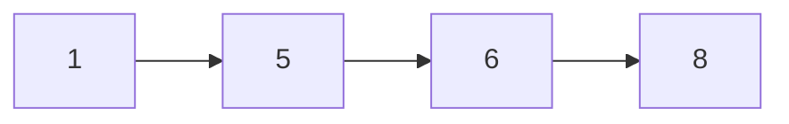

# Reflection

## 💳 문제이해

N x N 매트릭스, 정수로 채워진 표가 주어졌을 때, 횟수 `M`개의 쿼리가 주어지며,
각 쿼리는 ($x_i, y_i$)부터 ($x_j, y_j$) 까지의 부분 그리드 내의 합을 구하세요.

## 🚥 문제접근

각 행과 열을 더하여 각 쿼리(구간)의 합을 구할 수 있지만 시간 복잡도는 최대 $O\
(N^N)$이나옵니다. 다만 N이 1024 작은 수여서 이대로 사용해도 될 거 같지만, 쿼리
개수, M이 최대 100,000 이므로 각 쿼리마다 해당 방법을 사용하기에는 시간 복잡도
$O(M \times N^2)$로 많이 비효율적입니다.

N이 비교적 작은 수라는 것을 알았으니 N * N 을 돌려 누적합(prefix sum)을 미리
구한 다음에 계산한 다음에 시간 복잡도 $O(M)$를 기록할려고 만들겠습니다.

### 1️⃣  문제풀이

1. 메트릭스 누적합(prefix_sum) 구하기

- 사용할 자료 구조는 2차원 배열, 메르릭스에 주어진 행, 열 데이터를 저장합니다.
- 누접합은 `prefix_sum` 2차원 배열을 사용합니다.

행, 열의 누계합은 이전 행의 누계합, 이전 열의 누계합 그리고 현재 메트릭스 원소의 합계입니다.

index<br/>i/j| 0 | 1 | 2 | 3
:---:|:---:|:---:|:---:|:---:
0 | 1 | 2 | 3 | 4
1 | 2 | 3 | 4 | 5
2 | 3 | 4 | 5 | 6
3 | 4 | 5 | 6 | 7

**공식**:
$$현재\ 원소의\ 누계합 = 현재\ 원소의\ 값 + 이전\ 행의\ 누계합 + 이전\ 열의\ 누계합 - 이전\ 행/열의\ 누계합(중복 방지)$$

index<br/>i/j| 0 | 1 | 2 | 3
:---:|:---:|:---:|:---:|:---:
0 | 1 | 3 | 6 | 10
1 | 3 | 8 | 15 | 24
2 | 6 | 15 | 27 | 42
3 | 10 | 24 | 42 | 64


**예시**:
- 인덱스 [1, 1] 의 누계 합은 [0, 0] + [0, 1] + [1, 0] + [1, 1] 입니다.
- 공식 실행: 
    - 누계합[1, 1] = 3 + (1 + 2) + (1 + 2) - 1;
        - 1이 두번 더해지기 때문에 빼줍니다.
- 누계합[1, 1] = 1 + 2 + 2 + 3 = 8

##### 2. 구간 합 구하기

일차원 수열이면, 마지막 구간의 누계 합 - 시작하는 구간 이전 누계합을 계산해주면 되지만,



[2번째, 4번째]구간의 합 =  4번째 원소에 누계합(1 + 5 + 6 + 8) - 2번째 `이전` 원소의 누계합(1) = 19

<style>
    :root {
        --highlight-bg: #6666FF;
        --highlight-padding: 10px;
        --highlight-width: 10px;
        --highlight-height: 30px;

    }

    .highlight {
        background-color: var(--highlight-bg);
        padding: var(--highlight-padding);
        width: var(--highlight-width);
        height: var(--highlight-height);
        display: flex;
        align-items: center;
        justify-content: center;
        text-align: center;
        box-sizing: border-box;
    }
</style>

<style> 
    :root {
        --highlight-minus-bg: #808080;
        --highlight-padding: 10px;
        --highlight-width: 10px;
        --highlight-height: 30px;
    }

    .highlight-minus {
        background-color: var(--highlight-minus-bg);
        padding: var(--highlight-padding);
        width: var(--highlight-width);
        height: var(--highlight-height);
        align-items: center;
        justify-content: center;
        text-align: center;
        display: flex;
    }
</style>
<div>

index<br/>i/j| 0 | 1 | 2 | 3
:---:|:---:|:---:|:---:|:---:
0 | <div class="highlight-minus">1</div> | <div class="highlight-minus">2</div> | <div class="highlight-minus">3</div> | 4
1 | <div class="highlight-minus">2</div> | <div class="highlight">3</div> | <div class="highlight">4</div> | 5
2 | <div class="highlight-minus">3</div> | <div class="highlight">4</div> |<div class="highlight"> 5</div> | 6
3 | <div class="highlight-minus">4</div> | <div class="highlight">5</div> | <div class="highlight">6</div> | 7

표(메트릭스)는 구간이 인덱스[i, j] 기준:
- [1, 1] 부터 [2, 3]이면,
- [0, 0], [0, 1], [0, 2], [1, 0], [2, 0], [3, 0]을 누계합[3, 2]에서 빼야 합니다.

</div>

표를 보시 대충 어디를 빼야 하는지 감이 잡힙니다.

**공식:**
$$구간[i, j]부터[x, y] = 누계합[x, y] - 누계합[i - 1, y] - 누계합[x, j - 1] + 누계합[x - 1, y - 1]$$

**예시:**
- [0, 0], [0, 1], [0, 2]는 누계합[0, 2]으로 구할 수 있습니다.
- [0, 0], [1, 0], [2, 0], [3, 0]은 누계합[3, 0]으로 구할 수 있습니다.
- 이제 이 값을 누계합[3, 2]에서 빼줍니다.
- [0, 0] 이 두 번 빠지므로, 누게합[1 - 1, 1 - 1]인 [0, 0]을 한 번 더 해줍니다.

그러면 구간[1, 1]부터 [3, 2]까지의 합을 구할 수 있습니다.

#### 소스 코드(source code)

```py
import sys;
def calculate_prefix_sum(grid, N):
    prefix_sum = [[0] * (N + 1) for _ in range(N + 1)]
    
    for i in range(1, N + 1):
        for j in range(1, N + 1):
            prefix_sum[i][j] = grid[i-1][j-1] + prefix_sum[i-1][j] + prefix_sum[i][j-1] - prefix_sum[i-1][j-1]
    
    return prefix_sum


inputed: list[str]= list(sys.stdin.readline().rstrip().split());

N, M = int(inputed[0]), int(inputed[1]);

matrix: list[list[int]] = [[0 for _ in range(0, N)] for _ in range(0, N)];

for index in range(0, N):
    row: list[str] = list(sys.stdin.readline().rstrip().split());
    for index_j in range(0, N):
        matrix[index][index_j] = int(row[index_j]);


prefix_sum: list[list[int]] = calculate_prefix_sum(matrix, N);

for x in range(0, N):
    for y in range(0, N)
        if x == 0 and y == 0:
            prefix_sum[i][j] = matrix[i][j];
        if x == 0:
            prefix_sum[i][j] = prefix_sum[i][j - 1] + matrix[i][j];
        if y == 0:
            prefix_sum[i][j] = prefix_sum[i - 1][j] + matrix[i][j];
        else:
            prefix_sum[i][j] = matrix[i][j] + prefix_sum[i - 1][j] +
                prefix_sum[i][j - 1] - prefix_sum[i - 1][j - 1];


ranges: list[dict] = list();

for _ in range(0, M):
    inputed: list[str] = list(sys.stdin.readline());
    ranges.append({
        "i": int(inputed[0]),
        "j": int(inputed[1]),
        "x": int(inputed[2]),
        "y": int(inputed[3]),
            });

for range in ranges:
    i: int = range["i"] - 1;
    j: int = range["j"] - 1;
    x: int = range["x"] - 1;
    y: int = range["y"] - 1;

    a: int = prefix_sum[x - 1][y - 1];
    b: int = 0;
    c: int = 0;
    d: int = 0;

    minus_i: int = 1;
    minus_j: int = 1;
    if i == 0:
        minus_i = 0;
    elif j == 0:
        minus_j = 0;

    sum: int = prefix_sum[x][y] - prefix_sum[i - minus_i] - prefix_sum[x][j - minus_j] +
        prefix_sum[i - minus_i][j - minus_j];

    print(sum);
```

다만 위에 소스 코드는 누적합계 배열이 인덱스 0부터 시작하므로 0으로 시작할 때
예의 처리를 해야 하지만, 인덱스 i, j가 0일 때 0으로 초기화하면 예의 처리 할 필요
갑 없습니다.

#### ⏰ 알고리즘 복잡도

- 시간복잡도: $O(n ^ n)$
- 공간복잡도: $O(n ^ n)$
