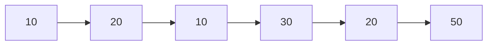
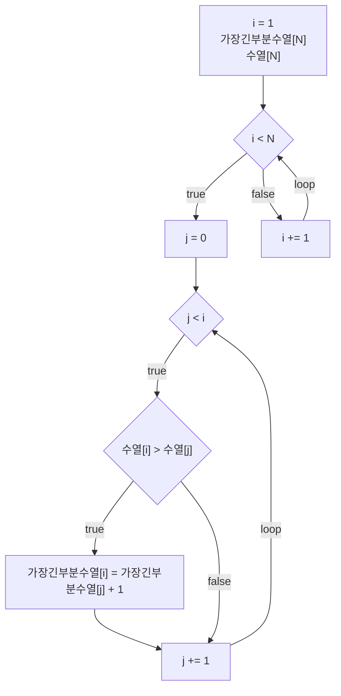
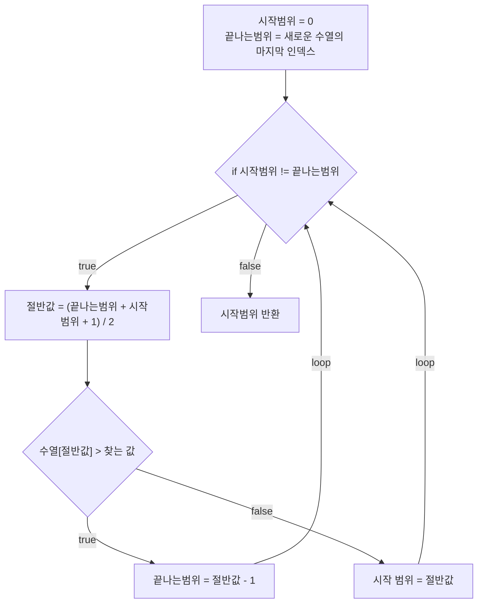
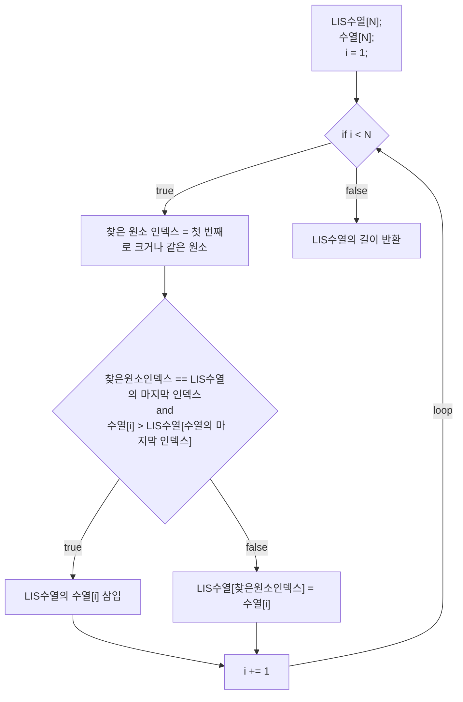

# 💳 문제이해

양의 정수 N개로 이루어진 수열이 주어졌을 때, 가장 긴 부분 수열의 길이을 구하세요.

# 🚥 문제접근

DP에서 풀었던 문제이므로, DP를 사용해봅니다.

첫 번째 원소부터 마지막 원소까지 순차적으로 탐색하면서, 새로운 배열에 
각 원소에 해당하는
가장 긴 부분 수열의 길이를 저장합니다.

예를 들어, 두 번째 원소의 값이 첫 번째 원소보다 크면 그 길이는 1 증가합니다.
반대로 작으면 첫 번째 원소부터 시작하여 현재 원소까지 저장된
가장 긴 길이를 찾고, 1을 더해 다음 원소로 이동합니다.

하지만, 이 방법은 시간 초과로 실패합니다.
이는 시간복잡도가 2차적으로 증가하기 때문에 N이 큰 겨웅
시간 초과가 발생할 수 있습니다. 더 빠른 방법이 필요합니다.


동적 계획법과 이분 탐색을 결합해 해결할 수 있습니다.

3 번째 원소인 10은 첫 번째 원소인 10과 같습니다. 

3 번째 원소 기준으로 가장 긴 부분 증가 수열은 10, 20 길이는 2입니다.

저희는 가장 긴 부분 증가하는 수열 자체를 구하는 게 아닌 해당 길이를 구합니다.

3 번째 원소 기준으로 비교 대상인 전 원소, 2 번째 원소를 제의한
이전의 원소에는 의미가 없습니다.
현재 기준 가장 긴 길이인 2를 구하였기 때문에, 이제 필요가 없는 거죠.
그러므로 나중에 나온 원소, 현재 3 번째 원소를 가장 긴 부분 수열에서,
첫 번째로 자신과 같거나 큰 원소를 찾아 대체합니다.

여기서 주목할 점은 대체해도 문제가 없다는 점입니다. 왜냐하면, 비교 대상인 2 번째
원소인 20이 있는 시점에서 그 이전에 원소들은 있으나 마나입니다. 
그러므로 3 번째 원소인 10을 본인보다 작거나 같은 값을 가진 1 번째
원소인 10이랑 바꿉니다. 바꾸는 이유는 나중에 3 번째 원소보다 크고
2 번째 원소 보다 작은 경우, 증가할 가능성이 있기 때문입니다.

요약하자면, 현재 원소가 이전 원소보다 크면, 현재 원소를 
새로 생성한 수열에 삽입합니다.
반대로 작거나 같으면, 새로 생성한 수열에서 현재 원소의 값과 같거나, 큰
첫 번째 원소와 바꿉니다.

이는 동적 프로그래밍과 이분탐색을 사용하여, 좀 더 빠르게 시간복잡도(log$_2$n)
가 걸립니다.

1. 20은 10보다 크므로, 10 < 20
2. 10은 20보다 작습니다. 10 < 20
    - 새로운 수열에서, 첫 번째로 해당 원소와 같거나 큰 값을 찾습니다.
    - 10을 찾았습니다.
3. 30은 20보다 큽니다. 10 < 20 < 30
    - 새로운 수열에 삼입합니다.
4. 20은 30보다 작습니다. 10 < 20 < 30
    - 새로운 수열에서, 첫 번째로 해당 원소와 같거나 큰 값을 찾습니다.
    - 20을 찾았습니다.
    - 20과 바꿉니다.
5. 50은 30보다 큽니다. 10 < 20 < 30 < 50
    - 50을 새로운 수열에 삼이합니다.

결과: 가장 긴 부분 수열의 길이는 4입니다.

## 💡 문제풀이

### 1️⃣  동적 계획법
1. Longest Increasing Subsequence(LIS) 가장 긴 부분 수열



하지만 실패
####   source code
```c
#include<stdio.h>
#include<stdint.h>

typedef struct {
    int32_t* arr;
    int32_t length;
} Array;
int32_t LIS(Array a) {
    int32_t LIS[a.length];
    int32_t max_length = 1;
    LIS[0] = 1;
    for (int32_t i = 1; i < a.length; a += 1) {
        for (int32_t j = 0; j < i; j += 1) {
            if (a.arr[i] > a.arr[j]) {
                LIS[i] = LIS[j] + 1;
            }
        }
        max_length = max_length < LIS[i] ? LIS[i] : max_length;
    }

    return LIS[a.length - 1];
}
int32_t main(void) {
    int32_t n;
    scanf("%d", &n);
    int32_t arr[n];
    for (int32_t i = 0; i < n; i += 1) {
        scanf("%d", &arr[i]);
    }

    Array a = {
        n, arr,
    }

    int32_t lis = LIS(a);
    printf("%d\n", lis);
    return 0;
}
```

### 2️⃣  이분탐색 & 동적 프로그래밍(LIS)

1. 이분탐색



2. 동적 프로그래밍



#### source code

```c
#include<stdio.h>
#include<stdint.h>

typedef struct {
    int32_t* arr;
    int32_t length;
} Array;

typedef struct {
	int32_t* arr;
	int32_t last_index;
} stack;

int32_t binary_search(stack* a, int32_t finding_num) {
	int32_t start = 0;
	int32_t end = a->last_index;

	while (start != end) {
		int32_t mid = (start + end) / 2;

		if (a->arr[mid] >= finding_num) {
			end = mid;
		} else if (a->arr[mid] < finding_num) {
			start = mid + 1;
		}

	}
	
	return start;
}
// void print_arr(stack a) {
// 	
// 	for (int32_t i = 0; i < a.last_index + 1; i += 1) {
// 		printf("%2d ", a.arr[i]);
// 	}
// 	printf("\n");
// 	return;
// }

int32_t LIS(Array *a) {
    int32_t LIS[a->length];
	LIS[0] = a->arr[0];
	stack s =  {
		LIS, 0,
	};
	printf("%ld\n",sizeof(s));
	printf("%ld\n", sizeof(*a));
    for (int32_t i = 1; i < a->length; i += 1) {
		int32_t index_found = binary_search(&s, a->arr[i]);

		if (index_found == s.last_index && 
				s.arr[index_found] <  a->arr[i]) {
			s.last_index += 1;
			*(s.arr + s.last_index) = a->arr[i];
		} else {
			*(s.arr + index_found) = a->arr[i];
		}
		// printf("index: %d; ", index_found);
		// print_arr(s);
    }

    return s.last_index + 1;
}
int32_t main(void) {
    int32_t n;
    scanf("%d", &n);
    int32_t arr[n];
    for (int32_t i = 0; i < n; i += 1) {
        scanf("%d", &arr[i]);
    }

    Array a = {
        arr, n,
    };

	int32_t lis = LIS(&a);
    printf("%d\n", lis);
    return 0;
}
```
