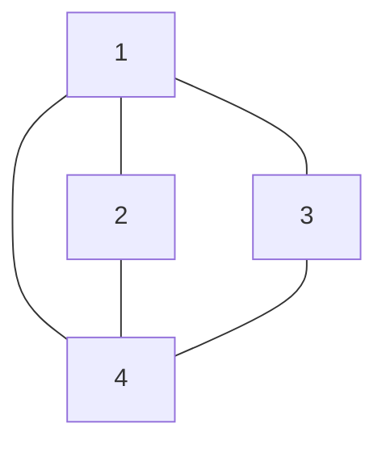

# 💳 문제이해

`N`개의 정점이과 `M`개의 간선이 주어지면, 오름차순으로 dfs와 bfs를 탐색한
순선대로 출력하시오.

# 🚥 문제접근

`dfs`와`bfs` 알고리즘을 구현할 줄 알면 어려운 문제는 아닙니다.

## 🛠️ 풀이



### ⚜️  dfs(depth-first search)

깊이를 우선으로 너비보다 우선적으로 탐색되어야 합니다. 재귀적으로 구현하거나,
나중에 들어오는 원소를 우선적으로 처리하는 `stack`을 사용하여 구현 할 수 
있습니다. 다만 스택은 정반대의 순서로 원소들을 처리합니다.

### 💠 bfs(breadth-first search)

너비를 우선으로 탐색합니다. `brute force`를 사용해서 탐색할 수도 있겠지만,
각 노드의 인접한 노드들을 파악 할 수 가 없어, 자료 구조 `queue`를 구현하여
`dfs`와 대비적으로 먼저 들어오는 원소를 처리합니다.

### 🖥️ source code

```c
#include<stdio.h>
#include<stdint.h>
#include<stdlib.h>

#define new_node()((Node*)malloc(sizeof(Node)))

typedef struct Node {
    int32_t data;
    struct Node* next;
} Node;

typedef struct Graph {
    Node** adj_list;
    int32_t num_vertices;
} Graph;

typedef struct queue {
	int32_t data;
	struct queue* next;
	struct queue* head;
} queue;

typedef struct stack {
	int32_t data;
	struct stack* back;
	struct stack* next;
} stack;

stack* push(stack* a, int32_t val) {
	stack* new = (stack*)malloc(sizeof(stack));
	new->next = NULL;
	new->back = NULL;
	new->data = val;
	if (a == NULL) {
		a = new;
	} else {
		new->back = a;
		a->next = new;
		a = new;
	}
	return a;
}

stack* pop(stack* a) {
	if (a != NULL) {
		if (a->back == NULL) {
			free(a);
			return NULL;
		} else {
			a->back->next = a->next;
			stack *temp = a->back;
			free(a);
			return temp;
		}
	}
	return NULL;
}
int32_t create_queue(queue** q, int32_t val) {
	if (*q == NULL) {
		*q = (queue*)malloc(sizeof(queue));;
		(**q).next = NULL;
		(**q).data = val;
		(**q).head = (*q);
	}
	return 0;
} 

int32_t enqueue(queue** q, int32_t val) {
	if (*q == NULL) {
		create_queue(q, val);
	} else {
		queue* new_node = (queue*)malloc(sizeof(queue));
		new_node->next = (*q)->next;
		new_node->data = val;
		new_node->head = (**q).head;
		(**q).next = new_node;
		(*q) = new_node;
	}
	return 0;
}

int32_t dequeue(queue** q) {
	if (*q != NULL && (**q).head != NULL) {
		queue* temp = (*q)->head;
		(*q)->head = (**q).head->next;
		if (temp->next == NULL) {
			(*q) = NULL;
		}
		free(temp);
	}
	return 0;
}

Node* create_node(int32_t val) {
    Node* new_node = (Node*)malloc(1 * sizeof(Node));
    (*new_node).next = NULL;
    (*new_node).data = val;
    return new_node;
}

Graph* create_graph(int32_t num_vertices) {
    Graph* new_graph = (Graph*)malloc(1 * sizeof(Graph));
    (*new_graph).num_vertices = num_vertices;
    (*new_graph).adj_list = (Node**)malloc((num_vertices + 1) * sizeof(Node*));
    for (int i = 1; i <= num_vertices; i += 1) {
        (*new_graph).adj_list[i] = NULL;
    }
    return new_graph;
}

void insert_vertex(Graph* g, int32_t src, int32_t dst) {
	Node* src_node = create_node(dst);
	Node* current;
	if (*((*g).adj_list + src) == NULL || g->adj_list[src]->data >= dst) {
		src_node->next = *((*g).adj_list + src);
		*((*g).adj_list + src) = src_node;
	} else {
		current = g->adj_list[src];
		while (current->next != NULL && current->next->data < dst) {
			current = current->next;	
		}
		src_node->next = current->next;	
		current->next = src_node;
	}
	return;
}

void add_edge(Graph* g, int32_t src, int32_t dst) {
	insert_vertex(g, src, dst);	
	insert_vertex(g, dst, src);	
	return;
}

void print_dfs(Graph* g, int32_t R, int32_t* visited)  {
	if (visited[R]) {
		return;
	}
	printf("%d ", R);
	visited[R] = 1;
	Node* head_of_r = g->adj_list[R];
	while (head_of_r != NULL) {
		int32_t data = head_of_r->data;
		if (!visited[data]) {
			print_dfs(g, data, visited);
		}
		head_of_r = head_of_r->next;
	}
	return;
}

void print_bfs(Graph* g, int32_t R, int32_t N) {
	int32_t* visited = (int32_t*)calloc((N + 1), sizeof(int32_t));
	queue* q = NULL;
	create_queue(&q, R);
	visited[R] = 1;
	printf("%d ", R);
	while (q != NULL && q->head != NULL) {
		Node* head_of_r = g->adj_list[q->head->data];
		dequeue(&q);
		while (head_of_r != NULL) {
			int32_t data = head_of_r->data;
			if (!visited[data]) {
				visited[data] = 1;
				enqueue(&q, data);		
				printf("%d ", data);
			}
			head_of_r = head_of_r->next;
		}
	}	
	printf("\n");
	return;
}

int32_t main(void) {
    int32_t N, M, R;
	scanf("%d %d %d", &N, &M, &R);
	Graph* g = create_graph(N);
	for (int32_t i = 0; i < M; i += 1) {
		int32_t u, v;
		scanf("%d %d", &u, &v);
		add_edge(g, u, v);
	}
	int32_t* visited = (int32_t*)calloc((N + 1), sizeof(int32_t));
	print_dfs(g, R, visited);
	printf("\n");
	print_bfs(g, R, N);
	return 0;
}
```
