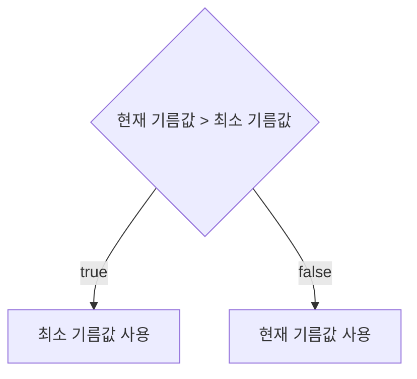

# 💳 문제이해

N개의 도시의 리터 값이 주어졌을 때 도시별 사이에 거리(km)가 주어진다.

이 때 최소한의 리터 값만을 지불하여 오른쪽 마지막 도시까지 도착해라.

# 🚥 문제접근

가장 좋은 방법은 최소 기름값만으로 기름을 채우는 것이다.

첫번째 도시에서 출발할 때 무조건 적으로 기름값을 내고 충전해야 한다.

즉슨 첫번째 도시가 도시들 중 가장 적은 기름값일 경우, 첫번째 도시에서 마지막 도시까지
필요한 기름을 충전하면 된다.

하지만 아닌 경우도 있다.

목표는 상대적으로 작은 기름 값으로만 충전 하면 된다는 말입니다.

하지만, 설령 첫번째 도시가 최소 기름값이 아니더라도, 좋든 싫든 다음 도시에 갈려면
기름을 무조건적으로 충전 해야 한다.

다음 도시에 도착했을 때 첫번째 도시보다 기름값이 적을 경우, 두번째 도시 기름 값으로
충전 할 이유가 없다. 그러니 첫번째 도시 기름값으로 기름을 충전하고 다음 도시로 나아간다.

이는 현재 상황에서 최선의 수를 선택하는 `grid` 형식의 문제이다.

## 1️⃣l 문제풀이

- 첫번째 도시에서 문조건 기름 충전
- 다음 도시 기름값이 이전 도시 기름값보다 클 경우 이전 도시, 최소 기름값을 대신 넣는다.



### source code

```c
#include<stdio.h>
#include<stdint.h>
#include<limits.h>

typedef struct City {
	int32_t price;
	int32_t distance;
} City;

void input_city(City a[], int32_t length) {

	for (int32_t i = 0; i < length - 1; i += 1) {
		scanf("%d", &a[i].distance);
	}

	for (int32_t i = 0; i < length - 1; i += 1) {
		scanf("%d", &a[i].price);
	}
	return;
}


uint64_t get_minimum_price(City a[], int32_t length) {
	int64_t return_value = 0;

	uint64_t sum_price = 0;
	if (a[0].price !=  0 && a[0].distance > INT_MAX / a[0].price) {
		sum_price = (uint64_t)a[0].price * a[0].distance;
	} else {
		sum_price = a[0].price * a[0].distance;
	}
	int32_t min_price = a[0].price;
	for (int32_t i = 1; i < length - 1; i += 1) {
		if (min_price > a[i].price) {
			min_price = a[i].price;
		}

		if (min_price !=  0 && a[i].distance > INT_MAX / min_price) {
			sum_price += (uint64_t)min_price * a[i].distance;
		} else {
			sum_price += min_price * a[i].distance;
		}
	}
	return_value = sum_price;
	return return_value; 
}
int32_t main(void) {

	int32_t N;
	scanf("%d", &N);
	City a[N];
	input_city(a, N);
	uint64_t sum_price = get_minimum_price(a, N);
	printf("%ld\n", sum_price);
	return 0;
}
```
