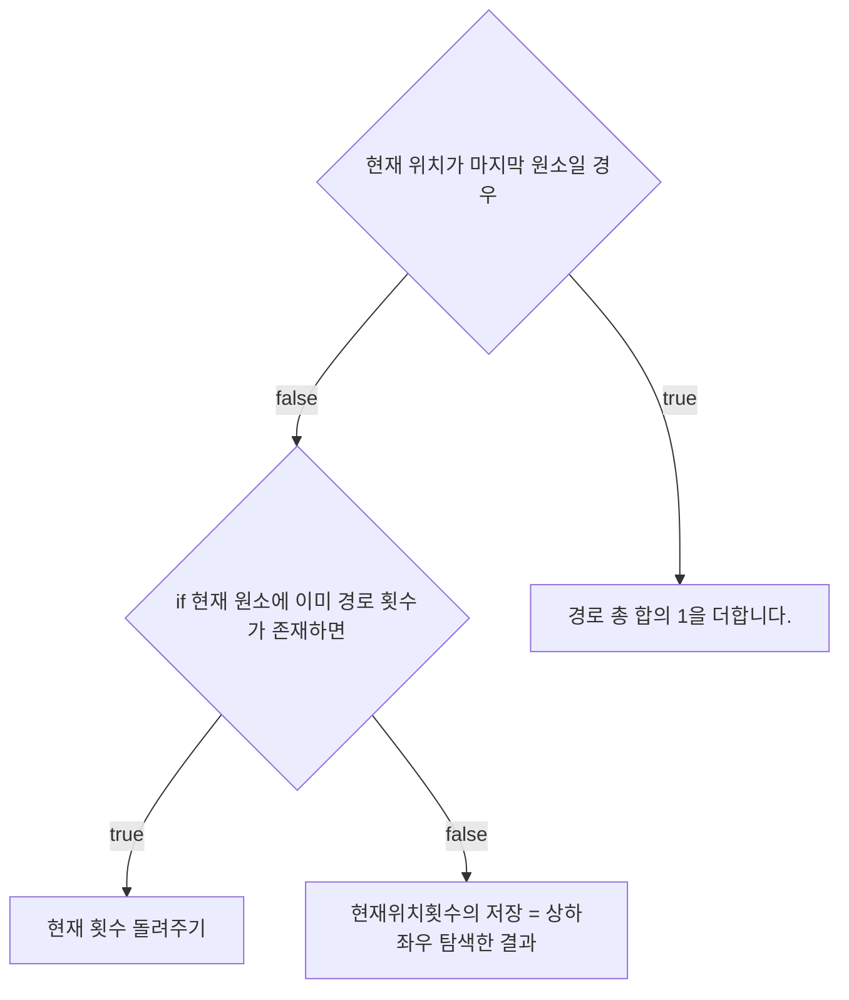

# 💳 문제이해

주어진 매트릭스는 M x N 크기이며, 각 원소는 10,000 이하의 자연수이다.
첫 번째 행의 첫 번째 열에서 출발하여 마지막 행의 마지막 열로 이동하려고 합니다.
이동할 수 있는 방향은 상하좌우이며, 다음 이동하려는 위치의
원소 값은 현재 위치의 원소 값보다 작아야 합니다. 이러한 조건을 만족하면서
오른쪽 아래 끝 원소까지 도달할 수 있는 모든 경로의 경우의 수를 구하시오.

# 🚥 문제접근

이러한 모든 경우의 수를 탐색하는 방법을 BFS, DFS를 사용한다고 알고 있다.

우선 작은 케이스로 풀어보려고 한다. 

## 2 x 2

x / y | 0 | 0
:---:|:---:|:---:
0 | 50 | 45
0 | 35 | 20

위와 같이 같이 2 x 2일 때는

1. 50에서 출발한다. 45, 35 모두 50보다 작다 갈 수 있는 원소이다.
2. 45의 우측 원소는 없으므로, 아래쪽 원소의 값인 20은 45보다 작다. 고로 
이 경로는 조건에 만족하므로 경로의 경우의 수에 추가한다.
3. 마찬가지로 35는 다음 원소가 20밖에 없다 20은 35보다 작으므로, 갈 수 있다.
따라서 이 경로도 추가한다.

결과적으로, 모든 경로의 경우의 수는 2이다.

2 x 2는 경우의 수가 적어 참고가 안 된다.
아무튼 이런 식으로 할 것이다.

## 3 x 3
x / y | 0 | 0 | 0
:---:|:---:|:---:|:--:
0 | 50 | 45 | 37 
0 | 35 | 20 | 25
0 | 30 | 21 | 5

50에서 시작해서 5에 도착해야 한다.

1. 오른쪽, 왼쪽 모두 50보다 작다.
    1. 45의 오른쪽 아래는 45보다 작다.
        1. 37의 아래는 37보다 작다.
            1. 25의 아래는 25보다 작다.
                - 도착
        2. 20은 오른쪽, 왼쪽, 아래는 모두 20보다 크다
            - 종료
    2. 35의 오른쪽은 오른쪽 아래는 35보다 작습니다.
        - 하지만 오른쪽인 20은 이미 탐색한 적이 있습니다. 결과 꽝입니다.
        1. 30의 오른쪽은 30보다 작습니다.
            1. 21의 오른쪽은 21보다 작습니다.
                - 도착

고로 결과는 도착이 두번, 꽝이 한번 입니다.

가운데 원소가 아무데도 갈 수 없어서 나올 수 있는 경로의 수가 작습니다.

위에처럼 풀면 될 것 같습니다.

dfs방식처럼 깊이를 먼저 탐색하여 20과 같은 원소는 꽝으로 저장하면서,
다음 원소의 깊이 때 다시 연산 할 필요가 없습니다.

탐색 범위는 상하좌우로 하고, 맨 끝에 있는 원소들은 바깥 원소들을 비교하여
임의로 최대값을 채웁니다.

목표에 도착했으면 dfs 특성인 이전에 거쳤던 노드들에 1을 추가합니다.

다시 탐색하는 노드가 0보다 클 경우 이미 거쳤던, 즉 목표에 도달한 게 보장
되므로 해당 값을 이전 노드에 추가합니다.

해당 노드에 3이 들어가 있다면, 해당 경로로 서로 다른 3번의 경로로 목표에 
도달 할 수 있다는 것을 의미합니다.

## 💡 문제풀이 



### source code

```c
#include<stdio.h>
#include<stdint.h>
#include<stdlib.h>

typedef struct {
	int32_t x;
	int32_t y;
	int32_t **mat;
	int32_t **dp;
	int32_t (*coord)[4];
	int32_t *N;
	int32_t *M;
} Matrix;

// void print_matrix(int32_t** a, int32_t N, int32_t M) {
// 	printf("-------------\n");
// 	for (int i = 0; i < M; i += 1) {
// 		for (int j = 0; j < N; j += 1) {
// 			printf("%2d ", a[i][j]);
// 		}
// 		printf("\n");
// 	}
// 	return;
// }

int32_t dfs(Matrix a) {
	int32_t x = a.x;
	int32_t y = a.y;

	if (x == *a.N && y == *a.M) {
		return 1; 
	}

	if (a.dp[y][x] != -1) {
		return a.dp[y][x];
	}

	a.dp[y][x] = 0;

	int32_t value = 0;
	for (int32_t i = 0; i < 4; i += 1) {
		if ((1 <= x && x < *a.N + 1) && (1 <= y && y < *a.M + 1)) {
			if (a.mat[y + a.coord[1][i]][x + a.coord[0][i]] < a.mat[y][x]) {
				Matrix new =  {
					x + a.coord[0][i],
					y + a.coord[1][i],
					a.mat,
					a.dp,
					a.coord,
					a.N,
					a.M,
				};
				value = dfs(new);
				a.dp[y][x] += value;
			}

		}
	}

	return a.dp[y][x];
}

void input_matrix(int32_t x, int32_t y, int32_t** a) {
	for (int i = 1; i < y + 1; i += 1) {
		for (int j = 1; j < x + 1; j += 1) {
			scanf("%d", &a[i][j]);
		}
	}
	return;
}

int32_t** allocate_double_array(int32_t M, int32_t N) {
	int32_t** a = (int32_t**)malloc(M * sizeof(int32_t*));
	for (int i = 0; i < M; i += 1) {
		a[i] = (int32_t*)calloc(N, sizeof(int32_t));
	}
	return a;
}
int32_t main(void) {
	int32_t N, M;
	scanf("%d %d", &M, &N);
	int32_t (*coord)[4];
	int32_t** a = allocate_double_array(M + 2, N + 2);
	int32_t** dp = allocate_double_array(M + 2, N + 2);
	int32_t coords[2][4] = {
		{0, 0, -1, 1},
		{-1, 1, 0, 0},
	};

	input_matrix(N, M, a);


	for (int i = 0; i < M + 2; i += 1) {
		for (int j = 0; j < N + 2; j += 1) {
			if (i == 0 || j == 0 || i == M + 1 || j == N + 1) {
				dp[i][j] = -1;
				a[i][j] = 10000;
			} else {
				dp[i][j] = -1;
			}
		}
	}

	coord = coords;

	Matrix m = {
		1, 1, a, dp, coord, &N, &M,

	};
	int32_t count_way = dfs(m);
	printf("%d\n", count_way);

	return 0;
}
```
