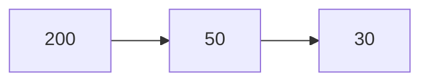
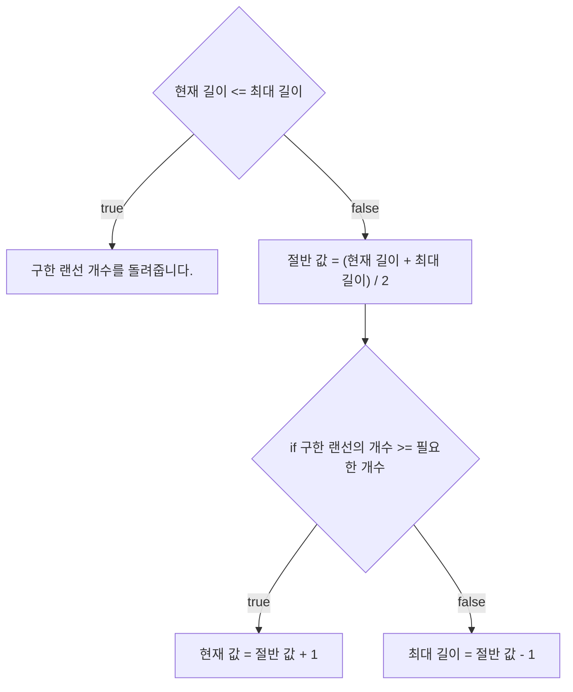

# 💳 문제이해

N개의 랜선이 주어졌을 때, 각 랜선을 나눌 수 있는 최대 길이로 나누세요.

# 🚥 문제접근

N개의 랜선의 각 길이를 더하고 K를 나누면 될 거 같지만, 

각 랜선은 독립적으로 나누어야 함으로 오차가 생길 것입니다.

- 그러면 문제를 어떻게 풀어야 할까요?

## 💡 문제 해결 방법

1. 가장 긴 랜선의 길이를 구합니다.

2. 해당 랜선의 길이를 반으로 나눕니다.

반으로 나누는 이유는 랜선이 두 개 이상이여도, 가장 긴 랜선의 절반이니까 
두 개이기 때문에 두 번째로 큰 랜선이 작으면 가잔 긴 랜선을 두 개로 취급 
할 수 있습니다.

예시:

랜선 두개를 구하세요


200을 두 개 쪼개서 100, 100. 100은 50보다 큽니다.

하지만 두 번째 랜선부터 길이가 최대 길이 랜선의 절반보다 길 수 도 있습니다.

이는 두 번째 랜선 길이가 거의 최대 길이의 랜선의 길이만큼 길 수 도 있습니다.

그래서 절반을 나눈 값을 최대 랜선 길이만큼 더해줌으로서, 위에 과정을 반복합니다.

예시:


랜선 2개를 구할 경우 최대 350 길이의 랜선 두 개를 구할 수 있습니다.

랜선 3개를 구할경우 위에 설명한 방법을 실행합니다.

1. 가장 긴 랜선은 500입니다.
2. 500의 절반은 250입니다.
3. 각 랜선의 길이를 250으로 나눈 값을 더합니다.
    1. 500을 250으로 나누면 2개의 랜선을 얻을 수 있습니다. 이제 나머지 1개의 랜선을 더 구해야 합니다.
    2. 380을 250으로 나누면 1개의 랜선을 얻을 수 있습니다. 이로써 필요한 랜선 3개를 모두 구했습니다.
4. 현재 구할 수 있는 랜선의 최대 길이는 250입니다. 하지만, 더 긴 랜선을 만들 수 있는 다른 경우가 있을 수 있으므로, 최대 길이까지 확인합니다. 현재 최대 길이의 절반 값을 더해가며 탐색을 이어갑니다.

5. 다음 중간 값은 375 = (251 + 500) / 2입니다.
6. 500을 375로 나누면 1개의 랜선을 얻습니다. 아직 3개를 모으지 못했습니다.
7. 이번에는 438 = (376 + 500) / 2로 계산합니다.
8. 500을 438로 나누면 1개의 랜선을 얻습니다.
9. 380을 438로 나누면 0개의 랜선을 얻습니다.
10. 3개의 랜선을 구할 수 없으므로, 최대 길이를 줄여야 합니다.
11. 최대 길이를 438에서 1 줄여서 437로 설정합니다.
12. 위 과정을 3개의 랜선을 구할 때까지 반복합니다.
13. 다음 중간 값은 406 = (376 + 437) / 2입니다.
14. 406을 380으로 나누면 0개의 랜선을 구할 수 있습니다.
15. 최대 길이를 다시 줄입니다.
16. 390 = (376 + 405) / 2로 계산합니다.
17. 390을 380으로 나누면 0개의 랜선을 구할 수 있습니다.
18. 최대 길이를 다시 줄입니다.
19. 382 = (376 + 389) / 2로 계산합니다.
20. 382로도 3개의 랜선을 구할 수 있지만, 이는 최대 길이가 아닐 수 있습니다.
21. 이번에는 378 = (376 + 381) / 2로 계산합니다.
22. 3개의 랜선을 얻을 수 있지만, 최대 길이가 아닙니다.
23. 다음 중간 값은 380 = (379 + 381) / 2입니다.
24. 이제 최대 길이가 380인 것 같습니다.
25. 종료 조건은 현재 길이가 더 이상 줄어들 수 없을 때입니다.
26. 381 = (381 + 381) / 2로 계산한 결과, 현재 길이는 381입니다.
27. 380이 마지막으로 구한 값이므로, 이를 반환하고 프로그램을 종료합니다.

#### flow chart 



#### source code

```c
#include<stdio.h>
#include<stdlib.h>
#include<stdint.h>

typedef struct {
    int32_t* lines;
    int32_t length;
} Array;

int32_t find_max(const Array* a) {
    int32_t max_num = a->lines[0];
    for (int32_t i = 1; i < a->length; i += 1) {
        if (max_num < a->lines[i]) {
            max_num = a->lines[i];
        }
    }
    return max_num;
}

int32_t get_count_divided(const Array* const a, const int32_t current_max_length) {
    int32_t count = 0;

    for (int32_t i = 0; i < a->length; i += 1) {
        count += a->lines[i] / current_max_length;
    }

    
    return count;
}

int32_t get_max_length(const Array* const a, int32_t K) {
    int64_t start_length = 1;
    int64_t max_length = find_max(a);
	int32_t result = 0;
	if (K == 1) {
		return max_length;
	} 

	if (max_length == 1) {
		return max_length * K;
	}

    while (start_length <= max_length) {
        int64_t mid = (start_length + max_length) / 2; 

		if (mid == 0) {
			return result;
		}
        int32_t count = get_count_divided(a, mid);

        if (count < K) {
			max_length = mid - 1;
        } else {
			start_length = mid + 1;
			result = mid;
		} 
    }

    return result;
}

void input_arr(int32_t* arr, int32_t length) {
    for (int32_t i = 0; i < length; i += 1) {
        scanf("%d", &arr[i]);
    }
    return;
}

int32_t main(void) {
    int32_t N, K;
    scanf("%d %d", &N, &K);
    Array a = {
        .lines = (int32_t*)malloc(N * sizeof(int32_t)),
        .length = N,
    };
    input_arr(a.lines, N);

    int32_t max_length = get_max_length(&a, K);
	printf("%d\n", max_length);
    return 0;
}
```
