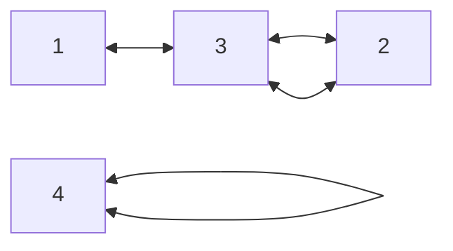

# 💳 문제이해

"그래프의 장점의 집합을 둘로 분할하여, 각 집합에 속한 정점끼리는 서로
인접하지 않도록 분할할 수 있을 때, 그러한 그래프를 특별히 이분 
그래프(Biparitite Graph)라 부른다. 그래프가 입력으로 주어졌을 때,
이 그래프가 이분 그래프인지 아닌지 판별하는 프로그램을 작성하시오."

그래프의 정점의 집합을 의미하는 게 간선이 주어지면 각 정점을 분할하라는
말일까요? 아니요, 그러한 말이 아닌 듯 싶습니다.

찾아보니 `Bipartitte Graph`는 두 개의 집합의 정점들로 구성되어 있습니다.
어떤 집합의 정점은 본인 집합의 정점과 인접/연결 할 수 없습니다. 인접하는 경우가
있으면 해당 그래프는 `Bipartite` 그래프가 **아닙니다**. 

`Bipartite` 그래프가 맞으면 `Yes`를 아니면 `No`를 출력하시오.

# 🚥 문제접근

그러면 그래프 내에서 어떻게 하면 해당 정점이 어떤 집합이고, 연결된 집합이 
다른 집합인지 알 수 있을까요? 우선은 어떤 정점의 인접한 노드들은 다른 집합으로 
판단합니다. 그리고 해당 정점의 인접한 정점중 본인과 같은 집합으로
판단되는 경우 `Bipartite`그래프가 아니라는 것을 판명 할수 있습니다.

우선은 간선을 모두 받아 그래프를 만듭니다. 아무 정점에서 순회를 시작합니다.

**입력**:
```
3 2
1 3
2 3
4 4
```
위처럼 입력이 간선, 정점(u, v)는 인접하다는 것을 뜻하는 간선이 주어집니다.


그러면 위와 같은 모양이 완성됩니다.

예시로 3번 부터 시작합니다.
3의 인접한 정점은 2입니다. 3을 집합 0이라고 가정합니다. 그러면 2는 자연스럽게
집합 1이라고 가정합니다. 다음으로 인접한 정점은 1입니다. 1 또한 집합
1이라고 가정합니다. 이제 2의 인접한 정점들을 탐색합니다. 3입니다. 3은
2와 서로 다른 집합임을 전 단계에서 판명하였습니다.

근데 4와 같은 정점은 위 그래프와는 독립된 그래프인데, 이걸 어떻게 처리할까요.
생각나는 방법 중 하나는, 1 부터 5까지 하나한 `DFS` 혹은 `BFS`를 통해 처리하는
것입니다. 이미 방문하였다면, 현재 노드와 인접한 노드의 집합 값을 비교합니다.

#### 🖥️ source code

```c
#include<stdio.h>
#include<stdlib.h>
#include<stdint.h>

#define CALLOC(type, len) (type*)calloc(len, sizeof(type))
#define FOR(i, n, in) for (int32_t i = 0; i < n; i += 1)
#define ADJ(g, src) g->adjacent_list[src]
#define PR_I(i) printf(#i": ")

typedef struct Node {
    int32_t val; 
    struct Node* next;
} Node;

typedef struct Graph {
    int32_t len;
    Node** adjacent_list;
} Graph;

Graph* create_graph(int32_t len) {
    Graph* new_g = CALLOC(Graph, 1);
	new_g->len = len;
    new_g->adjacent_list = CALLOC(Node*, (len + 1));
    FOR(i, (len + 1), 1) new_g->adjacent_list[i] = NULL;
    return new_g;
}

Node* create_node(int32_t val) {
    Node* n = CALLOC(Node, 1);  
    n->val = val;
    n->next = NULL;
    return n;
}

Graph* add_edge(Graph* g, int32_t src, int32_t dest) {
    Node* dest_node = create_node(dest);
    dest_node->next = ADJ(g, src);
    ADJ(g, src) = dest_node;

    Node* src_node = create_node(src);
    src_node->next = ADJ(g, dest);
    ADJ(g, dest) = src_node;
    return g;
}

int32_t DFS(Graph* g, int32_t* colors, int32_t node, int32_t color) {
	Node* temp = g->adjacent_list[node];
	*(colors + node) = color;

	while (temp != NULL) {
		int32_t adj_node = temp->val;

		// not searched
		if (colors[adj_node] == -1) {
			// if 1 then 0, if 0 then 1
			if (!DFS(g, colors, adj_node, 1 ^ color)) {
				return 0;
			}
		// if same set is not bipartite graph	
		} else if (colors[adj_node] == color) {
			return 0;
		}
		temp = temp->next;
	}
	return 1;
}
int32_t is_bipartite(Graph* g) {
	int32_t* colors = CALLOC(int32_t, (g->len + 1));
	for (int32_t i = 1; i <= g->len; i += 1) {
		colors[i] = -1;	
	}
	for (int32_t i = 1; i <= g->len; i += 1) {
		if (colors[i] == -1) {
			if (!DFS(g, colors, i, 0)) {
				return 0;
			}
		}
	}
	free(colors);
	return 1;
}

int32_t print_graph(Graph* g) {
    for (int32_t i = 1; i <= g->len; i += 1) {
        Node* temp = ADJ(g, i);
		// PR_I(i);
        while (temp != NULL) {
            printf("%2d ", temp->val);
            temp = temp->next;
        }
        printf("---\n");
    }
	return 0;
}

int32_t main(void) {
    int32_t T;
    scanf("%d", &T);
    while (T--) {
        int32_t V, E;
        scanf("%d %d", &V, &E);
        Graph* g = create_graph(V);
		
		// PR_I(T);
        while(E--) {
            int32_t u, v;
            scanf("%d %d", &u, &v);
			add_edge(g, u, v);
        }
		if (is_bipartite(g)) {
			printf("YES");
		} else {
			printf("NO");
		}
		printf("\n");
        // print_graph(g);
    }
    return 0;
}
```;
