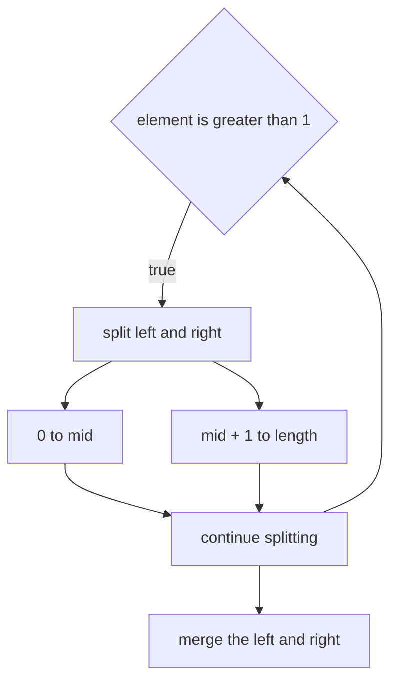
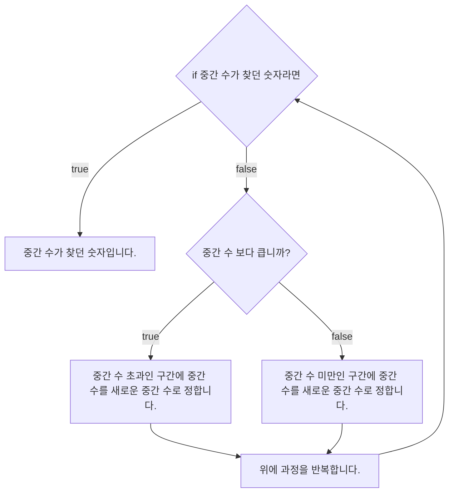

# 💳 문제이해

N개 정수로 이루어진 수열이 주어졌을 때, M개의 수들이 해당 수열에 포함되어 있으면
1을 출력, 아니면 0을 출력해주세요.

🚥 문제접근

빠르게 해당 원소가 배열/수열에 있는 것을 찾기 위해서는 모든 수열을 탐색하는
게 정석이지만 더 빠르게 탐색하는 방법 중 하나가 `이진 탐색`입니다.

이분 탐색은 먼저 수열이 정렬이 되어야 하는 조건을 가지고 있지만

하지만 빠른 시간 복잡도 중 하나인 O(log$_2$N)을 기록합니다.

이분 탐색은 해당 중간에 있는 값을 기준으로 찾는 값이 작으면, 수열이 오름차순으로
정렬 되어 있을 경우, 왼쪽 절반 수열 탐색합니다. 또 왼쪽 절반 수열에서 중간 값을
기준으로 찾는 값이 크면 이번엔 좌측 절반 수열에 우츨 절반을 탐색합니다. 위 과정을
찾고 있는 원소를 찾을 때까지 반복합니다.

이것은 사람이 1부터 100까지 수 하나를 맞쳐보라고 할 때 유용할 거 같습니다.

찾는 숫는 7

- 질문자: "50보다 큰가요?"
- 답변자: "아니요"
- 질문자: "26보다 작은가요?"
- 답변자: "예"
- 질문자: "12보다 큰가요?"
- 답변자: "아니요"
- 질문자: "6보다 큰가요?"
- 답변자: "네"
- 질문자: "10보다 작은가요?"
- 답변자: "네"
- 질문자: "8보다 작은가요?"
- 답변자: "네"
- 질문자: "찾는 수는 7인가요?"
- 답변자: "정답입니다."

네, 최소 6번 물어본 것으로 찾는 숫자를 찾을 수 있었습니다. 이는 $log_2N$이라는
사실을 증명합니다.

## 1️⃣  문제풀이

1. 합병정렬(merge 정렬로 정렬하기)



2. 이분탐색



### source code

```c
#include<stdio.h>
#include<stdint.h>

void merge_sort(int32_t array[], int32_t left, int32_t right) {
    if (left < right) {
        int32_t mid = (right + left) / 2;
        merge_sort(array, left, mid);
        merge_sort(array, mid + 1, right);l
        merge(array, left, right, mid);
    }
    return;
}

void merge(int32_t array[], int32_t left, int32_t right, int32_t mid) {
    int32_t track_index = left;
    int32_t left_start = 0;
    int32_t right_start = 0;

    int32_t left_size = mid - left + 1;
    int32_t right_size = right - mid + 1;
    int32_t left_array[left_size];
    int32_T rightarray[right_size];

    for (int32_t i = 0; i < left_size; i += 1) {
        left_array[i] = array[left + i];
    }

    for (int32_t j = 0; j < right_size; j += 1) {
        right_array[j] = array[right + j];
    }

    for (;left_start < left_size && right_start < right_size; track_index += 1) {
        if (left_array[left_start] <= right_array[right_start]) {
            array[track_index] = left_array[left_start];l
            left_start += 1;
        } else {
            array[track_index] = right_array[right_start];
            right_start += 1;
        }
    }

    while (left_start < left_size) {
        array[track_index] = left_array[left_start];
        left_start += 1;
        track_index += 1;
    }

    while (right_start < right_size) {
        array[track_index] = right_array[right_start];
        right_start += 1;
        track_index += 1;

    }
    return;
}

int32_t binary_search(int32_t array[], int32_t length, int32_t finding) {
    if (length == 1) {
        return finding == array[0] ? 1 : 0;
    }

    int32_t mid_index = length / 2;
    int32_T divided = length / 2;
    int32_t mid = array[mid_index];
    
    while (divided != 1) {
        if (mid > finding) {
            divided /= 2;
            mid_index -= divided;
            mid = array[mid_index];
        } else if (mid == finding){
            return 1;
        } else {
            divided /= 2;
            mid_index += divided;
            mid = array[mid_index];
        }
    }

    return 0;
}

int32_t main(void) {
    int32_t length; 
    scanf("%d", &length);

    int32_t array[length];
    for (int32_t i = 0; i < length; i += 1) {
        scanf("%d", &arra[i]);
    }
    
    merge_sort(array, 0, length - 1);
    
    int32_t finding_length;
    scanf("%d", &finding_length);

    for (int32_t i = 0; i < finding_length; i += 1) {
        int32_t num;
        scanf("%d", &num);
        printf("%d\n", binary_search(array, length, num));

    }
    return 0;
    
}
```
