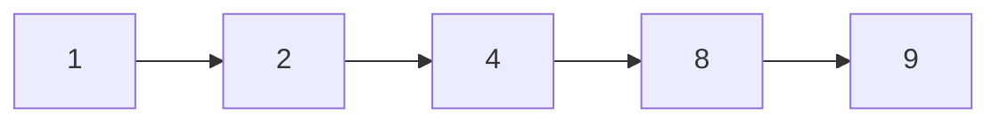
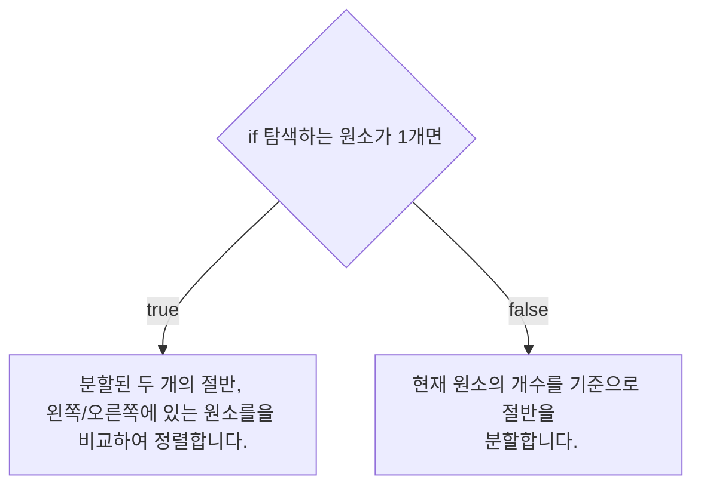
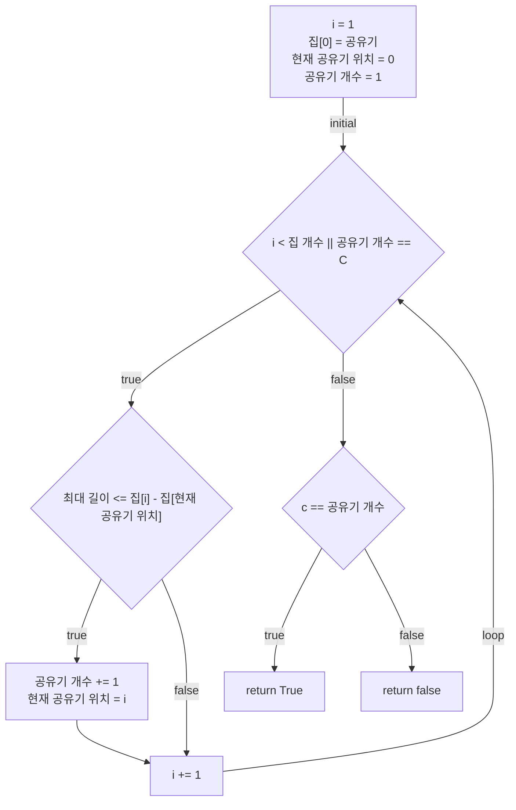
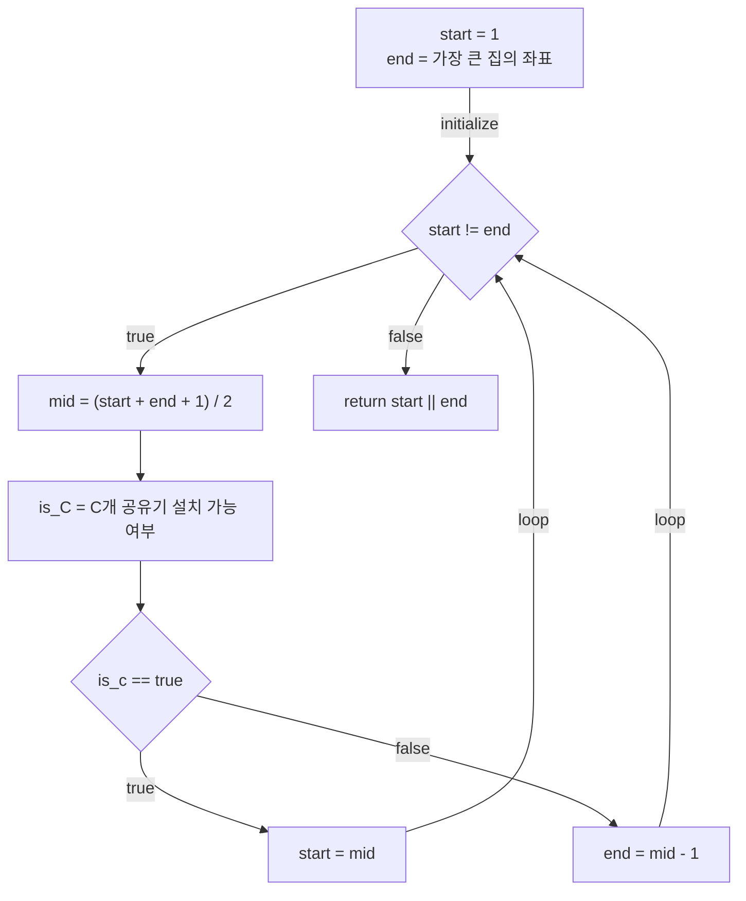

# 💳 문제이해

집의 좌표 N개와 공유 개수 C개가 주어졌을 때, 각 공유기를 집에다가 설치
하였을 때, 가장 인접한 두 공유기 사이의 거리를 가능한 크게 한 거리를
구하세요.

# 🚥 문제접근

공유기의 개수가 N개이면 가장 인접한 두 공유기 사이의 거리를 가능한 크게 한
거리는 1입니다.

이는 굳이 이분탐색을 하지 않아도, 모든 집에 설치 된 공유기의 거리가
1인 걸 알 수 있습니다.

우선, 공유기 간의 거리를 알려면, 정렬이 되어야 함으로 정렬을 먼저 합니다.



1. 탐색 범위는 1부터 최대 집의 좌표입니다.
2. 탐색 범위의 절반의 거리를 설정합니다.
3. 첫 번째 집의 공유기를 설치하여 설정한 거리만큼 떨어진 집에 설치를 합니다.
총 C개 설치할 수 있는지 확인합니다.

4. 공유기를 모두 설치 할 수 있다면, 거리를 더 크게 할 수 있는 확인하기
위해 탐색 범위를 늘리고, 설치할 수 없다면 탐색 범위를 줄입니다.

## 💡 문제풀이과정

1. 정렬(합병 정렬)

주어진 집의 좌표들을 합병 정렬을 사용해 정렬합니다.



2. C개의 공유기를 설치 가능 여부 확인



3. 이분탐색



### source code

```c
#include<stdio.h>
#include<stdint.h>

typedef struct {
    int32_t length;
    int32_t* arr;
} Array;

typedef struct {
    int32_t left;
    int32_t right;
    int32_t mid;
} Position;

void merge(const Array const* a, const Position const* b) {
    int32_t left_size = b->mid - b->left + 1;
    int32_t right_size = b->right - (b-> mid + 1) + 1;
    
    int32_t left_arr[left_size];
    int32_t right_arr[right_size];
    for (int32_t i = 0; i < left_size; i += 1) {
        left_arr[i] = a->arr[i + left];
    }
    for (int32_t i = 0; i < right_size; i += 1) {
        right_arr[i] = a->arr[i + mid + 1];
    }

    int32_t index_left = 0;
    int32_t index_right = 0;
    int32_t index_track = left;

    for (; index_left < left_size || index_right < right_size; index_track += 1) {
        if (left_arr[left_size] <= right_arry[right_index]) {
            a->arr[index_track] = left_arr[index_left];
            left_size += 1;
        } else {
            a->arr[index_track] = right_arr[index_right];
            index_right += 1;
        }
    }

    for (;index_left < left_size; index_left += 1, index_trac += 1) {
        a->arr[index_track] = left_arr[index_left];
    }

    for (; index_right < right_size; index_right += 1, index_trac += 1) {
        a->arr[index_track] = right_arr[index_right];
    }

    return;

}

void merge_sort(const Array const * a, const int32_t left, const int32_t right) {
    if (left <= right) {
        int32_t mid = (left + right) / 2;
        merge_sort(Array, left, mid);
        merge_sort(Array, mid + 1, right);
        Position = {
            left, right, mid,
        }
        merge(Array, &Position);
    } 
    return;
}

int32_t is_C(const Array const* a, const int32_t const* C, const int32_t 
*current_difference) {
    int32_t current_network_address = 0;
    int32_t count_network;

    for (int32_t i = 1; i < a->length; i += 1) {
        if (current_difference <= a->arr[i] - a->arr[current_network_address]) {
            current_network_address = i; 
            count_network += 1;
        }

        if (C == count_network) {
            return 1;
        }
    }
    
    return 0;
}

int32_t binary_search(const Array const* a, const int32_t C) {
    merge(Array, 0, a->length - 1);
    int32_t start = 1; 
    int32_t end = a->arr[length - 1];

    while (start != end) {
        int32_t mid = ((int64_t)start + end + 1) / 2;

        int32_t is_c = is_C(a, &C, &mid);

        if (is_c == 1) {
            start = mid;
        } else {
            end = mid - 1;
        }
    }

    return start || end;
}

int32_t main(void) {

    int32_t N, C;
    scanf("%d %d", &N, &C);
    int32_t arr[N];

    for (int32_t i = 0; i < N; i += 1) {
        scanf("%d", &arr[i]);
    }

    Array a = {
        N,
        arr,
    };

    int32_t max_length = binary_search(&a, C);
    return 0;
} 
```
