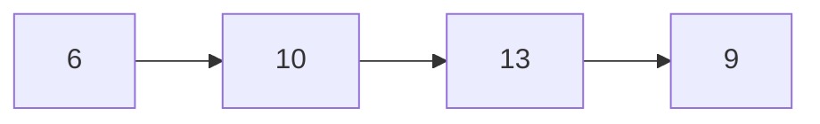
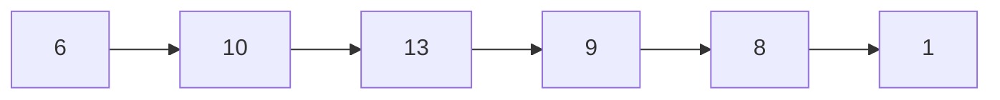
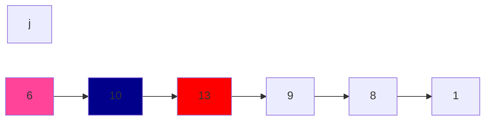

# Reflection

## 💳 문제 내용
정수 수열 길이 N에서 연속으로 3번 더하지 않고, 최대 합을 구합니다.



만약에 해당 수열이 6, 10, 13이면
n번째 인덱스에서 다음 인덱스 요소를 더한 값을 최대 금액과 비교하면 됩니다.

### ❗❗❗1️⃣ 풀이



각 요소를 처리할 때 경우의 수는 6, 10을 더하거나 6뛰고 다음 수를 더하거나.

하지만 가독성을 위해 위치 + 2, 뒤에서부터 시작하겠습니다.
- 3번째 요소인 13부터 시작.

경우의 수는 3개
- 6 + 13, 6 + 10, 13
- 현재 위치 - 2 + 현재 위치
- 현재 위치 - 2 + 현재 위치 - 1
- 현재 위치

**프로세스**:
1. sequence[13] = max(19, 16, 13) = 19
2. sequence[9] = max(19, 29, 9) = 29 ....?
어 이러면, 6 + 10 + 13 연속 3개이기 때문에 조건에 어긋납니다.
3. sequence[8] = max(27, 48, 8) = 48
4. sequence[1] = max(30, 77, 1) = 77
결과적으로, 6 + 10 + 13 더한 값을 반복적으로 더하고 있습니다.
> 잘못 되었습니다.



```c
for (int32_t index = 2; index < length; index += 1) {
    int32_t way_one_value = sequence[index - 2] + sequence[index];
    int32_t way_two_value = sequence[index - 2] + sequence[index - 1];
    int32_t way_three_value = sequence[index];

    if (way_one_value > way_two_value) {
        sequence[index] = way_one_value;
        if (way_one_value > way_three_value) {
            sequence[index] = way_three_value;
        }
    } else if (way_two_value > way_three_value) {
        sequence[index] = way_two_value;
    } else {
        sequence[index] = way_three_value;
    } 
}
```
<h3 style="text-align: center;">실패했습니다.</h3>

### 2️⃣ 풀이 참고


단순하게 생각해보겠습니다. 조건은 "연속적으로 3잔을 모두 마실 수는 없습니다."

주어진 수열에 요소를 순찬적으로 돌거에요. "x 번째 요소 까지 왔을 때, 더할 수 있는
최대합"을 기준으로 생각을 해봅니다. x 번째 요소를 무조건적으로 더하는게 아니라,
더하지 않았을 때 최대값이 되는 경우도 존재하기 때문입니다.

1. 첫번째 요소의 최대합은 첫번째 요소
2. 두번째 요소의 최대합은 첫번째 두번째 요소의 합니다.
    - 하지만 이 결과는 다음 요소에서 연속적으로 3번 조건에 영향을 미치는 것을 알아야 합니다.
3. 세번째 요소
    - 가능한 경우의 수
        1. 0 0 X 
        2. 0 X 0
        3. X 0 0
        4. X 0 X 
        5. X X 0
        6. 0 X X 
        7. X X X 

제시된 조건에 위배되지 않고 세 번째 요소에서 발생 할 수 있는 경우의 수입니다.

여기서 크게 두 그룹으로 구분 할 수 있을 거 같습니다.
- 세번째 요소를 더하지 않는 그룹: [1, 4, 6, 7];

세번째 요소를 더하지 않으면 다음 요소에서 영향을 주지 않습니다.
세번째 요소에서 끊으면 연속 수가 초기화 되기 때문입니다.
- 즉슨 x - 1번째 요소의 최대값은 x 번째의 최대값이 됩니다.

다만 위의 경우 어디까지나 X - 1 번째 요소가 최대값일 경우입니다.

이번에는 X 번을 더하고 최대값이 나오는 경우인 [2, 3, 5]

1. 0 X 0: 현재 요소 - 2 의 최대값 + 현재 요소 값
2. X 0 0: 현재 요소 - 3 의 최대값 + 현재 요소 값 - 1 + 현재 요소 값
    - 현재 요소에서 앞의 3번째인 이유는
    - ...0 X 0 0: 와 같은 형태여서 앞에서 3번째 최댓값을 가져옵니다.
3. X X 0: 연속으로 두번 비우지 않아도 조건에는 위반 되지 않기 때문에 1, 2번 룰을
적용합니다.

이제 실제 예제로 적용을 해봅니다.

#### 🧪예제 적용


- 요소의 배열은 sequence 배열로 정의합니다.
- 요소의 합은 dp 배열에 저장합니다.

1. 첫번째 요소에 최대값은 첫번째 요소입니다.
- 우선 1~3요소를 할당해줍니다.
- 첫번째 요소 최대값은 6
```c
dp[0] = sequence[0];
```
2. 두번째 요소에 최대값은 첫번째와 두번째 요소의 합입니다.
- 두번째 요소 최대 값은 6 + 10 = 16
```c
dp[1] = sequence[0] + sequence[1];
```
3. 세번째 요소에 최대값은 두번째 요소의 최대값, 세번째 요소 + 첫번째 요소,
   첫번째 요소 + 두번째 요소, 중에 가장 큰 값입니다.
- 세번째 요소 최대 값은 max(16, 19, 23) = 23

> 만약에 요소가 3번째인 13으로 끝났으면 답은 23입니다.
```c
dp[2] = get_max_from_three(dp[1], sequence[0] + sequence[2], sequence[1] + sequence[2]);
```

4. 네번째 요소에 최대값은 세번째 요소에 최대값, 네번째 요소 + 두번째 요소의 최대값,
네번째 요소 + 3번째 요소 + 1첫번째 요소의 최대값, 중에 가장 큰 값입니다.
- 4번째 요소부터 위에 정리한 방법을 적용하면 됩니다.
- 네번째 요소에 최대값 max(23, 27, 28) = 28 
- 여기서 10 + 13 루트는 버리고, 6 + 13 + 9로 갈아탑니다.

> 두 번째, 세 번째 수가 크다고 해서, 다른 더 많은 수를 더하면 더 클 수 도 있어요.

**공식**:
```c
dp[x] = get_max_from_three(dp[x - 1), sequence[x] + d[x - 2], sequence[x] 
+ sequence[x - 1] + dp[x - 3];
```
인자:
1. x를 더하지 않은 경우
2. 0 X 0: 인 경우
3. X 0 0: 인 경우 
```c
dp[3] = get_max_from_three(dp[2], sequence[3] + dp[1], sequence[3] + sequence[2]
+ dp[0]);
```

5. 5번째 요소에 최대값은 ... 중 가장 큰 값입니다.
- max(28, 31, 33) = 33
- before 5th max: 1(6) + 3(13) + 4(9)
- after 5th max: 1(6) + 2(10) + 4(9) + 5(8)
    
6. ...
- max(33, 29, 32) = 33

#### 🌐 표(table)
order|current value|maximum value|sequence
---:|:---:|:---:|:--
1|6|6|6
2|10|16| 6 -> 10
3|13|26| 10 -> 13 
4|9|28|6 -> 13 -> 9
5|8|33|6 -> 10 -> 9 -> 8
6|1|33|6 -> 10 -> 9 -> 8

결과적으로 저희는 dp[x - 1]\(index 가 0으로 시작하기 때문에 -1\)가 최대합인 걸 구할 수 있습니다:)
```c
maximum_sum = dp[x - 1];
```

### ref:
- [얍문/[ 백준 2156 ] 포도주 시식 (C++)](https://yabmoons.tistory.com/512)
