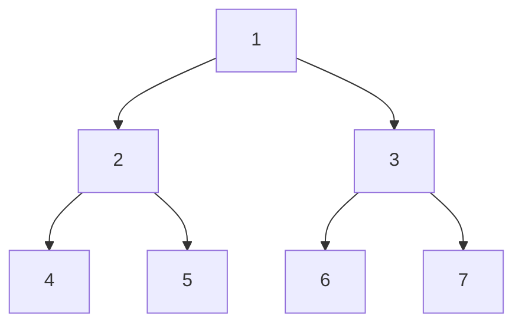

# 💳 문제이해

N개의 정점(노드)와 M개의 간선으로 구성(consist)된 무방향 그래프(undirected graph)
가 주어졌을 때, 너비 순으로 각 이웃 노드들을 오름차순으로 탐색 하였을 때
1~N의 방문 순서를 출력하세요. 방문하지 않았을 경우 0을 출력하세요.

# 🚥 문제접근

유사한 문제에서는 깊이를 우선해서 탐색하였지만, 이번에는 너비를 우선으로 
탐색합니다.

## 💠 bfs(Breath-first search)

너비 우선 탐색은 노드 트리/그래프에서 현재 깊이에서 같은 깊이에 있는
노드들을 우선적으로 탐색한 다음 깊이를 탐색합니다.

해당 알고리즘의 특징은 `queue` 자료구조 형을 사용하여,
현재 깊이의 있는 정점들을 우선적으로 넣고, 다음 깊이에 있는 노드들을 나중에 넣는
식입니다.


BFS 시작 노드 1: 
- `dequeue`: 원소를 큐에서 빼는 행위
- `queue`: 원소를 큐에 넣는 행위

1. 1을 큐에 넣습니다. 
    - 큐: `[1]`
2. 1을 큐에서 뺍니다(`dequeue`) 루트인 1을 방문합니다. 1의 이웃 노드들을 큐에 
넣습니다(queue).
    - 방문: `[1]`; 큐: `[2, 3]`
2. 2를 `dequeue`하고 2를 방문합니다. 2의 이웃 노드들을 `queue`.
    - 방문: `[1, 2]`; queue: `[3, 4, 5]`
3. 3을 `dequeue`, 3을 방문합니다. 3의 이웃 노드들을 `queue`.
    - 방문: [1, 2, 3]; queue: [4, 5, 6, 7]
4. 4를 `dequeue`, 4를 방문합니다. 4는 이웃 노드들이 없습니다.
    - 방문: `[1, 2, 3, 4]`; queue: `[5, 6, 7]`

위에 과정을 `queue`가 빌 때까지 반복합니다.

결과적으로 방문 순서는 ,`[1, 2, 3, 4, 5, 6, 7]`가 됩니다.

이는 각 깊이에 있는 너비를 우선 탐색한 결과입니다.

## 🛠️ 분석

정점들과 간선이 주어지면, 이차원 배열을 사용해 그래프를 표현합니다.

**필요한 자료 구조:**

- 2차원배열: 그래프
- 방문배열: 방문을 기록하는 배열
- 이웃배열: 각 정점의 이웃 정점들의 길이를 저장하는 배열
- 순서배열: 각 정점의 방문 순서를 기록하는 배열

그래프의 각 정점은 1차원 배열의 인덱스로 표현합니다. 즉 배열의 각 요소는
그래프의 본체 정점입니다. 본체 정점의 대해 연결된 이웃 정점들을 2차원 배열의
저장합니다.

- `queue`: bfs에서 너비를 우선적으로 저장하기 위해 필요.


### 🖥️ source code

```c
#include<stdio.h>
#include<stdint.h>
#include<stdlib.h>

typedef struct queue {
    int32_t data;
    struct queue* next;
    struct queue* first;
} queue;

typedef struct {	
	int32_t** graph;
	int32_t* visited;
	int32_t* order;
	int32_t* neighbors;
	int32_t* N;
} Graph;

int32_t dequeue(queue* a) {
    if((*a).first != NULL) {
        queue* temp = a->first; 
		(*a).first = (*a).first->next;
		int32_t val = temp->data;
		free(temp);
		return val;
    }
    return 0;
}

void enqueue(queue** a, int32_t val) {
    if (*a == NULL || (*a)->first == NULL) {
		*a = (queue*)malloc(1 * sizeof(queue));
        (*a)->first = *a;
        (*a)->next = NULL;
        (*a)->data = val;
    } else {
        queue *b = (queue*)malloc(sizeof(queue) * 1);
		(*b).data = val;
		(*b).next = NULL;
		(*b).first = (*a)->first;
        (*a)->next = b;
		(*a) = b;
    }
    return;
}

int32_t peek(queue* a) {
    if (a->first == NULL) {
		printf("null: ");
        return 0;
    }
    return a->data;
}

int32_t empty(queue* a) {
	if (a->first == NULL) {
		return 1;
	}
	return 0;
}

int32_t compare(const void* a, const void* b) {
	return *(int32_t*)a - *(int32_t*)b;
}

int32_t dfs(Graph a, int32_t R) {
	queue* q = NULL;
	int32_t count = 1;
	enqueue(&q, R);

	for (int32_t i = 1; i <= *a.N; i += 1) {
		if (a.graph[i] != NULL) {
			qsort(a.graph[i], a.neighbors[i], sizeof(int32_t), compare);
		}
	}
	a.visited[R] = 1;

	while (!empty(q)) {
		int32_t num = dequeue(q);
		a.order[num] = count++;

		for (int32_t i = 0; i < a.neighbors[num]; i += 1) {
			if (!a.visited[a.graph[num][i]]) {
				a.visited[a.graph[num][i]] = 1;
				enqueue(&q, a.graph[num][i]);
			}
		}
	}

	return 0;
}

int32_t main(void) {
	int32_t N, M, R;
	scanf("%d %d %d", &N, &M, &R);
	Graph a = {
		.order = (int32_t*)calloc((N + 1), sizeof(int32_t)),
		.graph = (int32_t**)malloc((N + 1) * sizeof(int32_t*)),
		.visited = (int32_t*)calloc((N + 1), sizeof(int32_t)),
		.N = &N,
		.neighbors = (int32_t*)calloc((N + 1), sizeof(int32_t)),
	};

	for (int32_t i = 0; i < M; i += 1) {
		int32_t u, v;
		scanf("%d %d", &u, &v);
		a.graph[u] = (int32_t*)realloc(a.graph[u], (a.neighbors[u] + 1) * sizeof(int32_t));
		a.graph[v] = (int32_t*)realloc(a.graph[v], (a.neighbors[v] + 1) * sizeof(int32_t));

		a.graph[u][a.neighbors[u]++] = v;
		a.graph[v][a.neighbors[v]++] = u;
	}

	dfs(a, R);
	for (int32_t i = 1; i <= N; i += 1) {
		printf("%d\n", a.order[i]);
	}
    return 0;
}
```
