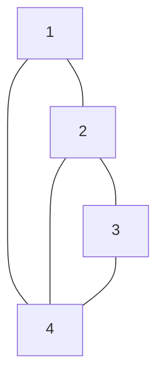

# 💳 문제이해

N개의 정점(노드)과 M개의 간선(edge)으로 구성된 무방향 그래프가 주어집니다.
정점(노드)의 번호는 1번 부터 N번입니다. 모든 간선의 가중치는 1입니다. 각 정점
(노드)가 주어졌을, 때 정점(노드) R에서 시작하여 깊이 우선 탐색으로 노드를
방문할 경우 노드의 방문 순서를 출력합니다.

# 🚥 문제접근 

우선 예제를 분석해보겠습니다.

## 🌏 예제

```
5 5 1
1 4
1 2
2 3
2 4
3 4
```
- N: 5
- 간선: 5
- R: 1

각 연결된 간선이 주어집니다. 그래프를 만들어봅니다.

**그래프:**



R이 1이므로 1부터 시작합니다.

1. 1을 출력합니다.
2. 그 다음이 4와 2가 있지만, 2 밑에 4가 있으므로 4를 먼저 출력합니다.
3. 2 다음에 4와 3이 있지만, 3밑에 4가 있으므로 3을 출력합니다.
4. 4를 출력합니다.
5. 시작 노드에서 더 이상 방문할 정점이 없습니다.

아니면 오름차순으로 방문한 것일 수 도 있겠네요.

**dfs 탐색 의사 코드:**
```scss
dfs(V, E, R) {  # V : 정점 집합, E : 간선 집합, R : 시작 정점 
    visited[R] <- YES;  # 시작 정점 R을 방문 했다고 표시한다.
    for each x ∈ E(R)  # E(R) : 정점 R의 인접 정점 집합.(정점 번호를 오름차순으로 방문한다)
        if (visited[x] = NO) then dfs(V, E, x);
}
```

## 🛠️ 분석

이차원 배열을 사용하여 무방향 그래프(undirected graph) 를 표현합니다.

- dfs에서 노드의 방문 여부를 저장해주는 방문 배열을 준비합니다.
- 오름차순이라고 했으니까 오름차순으로 각 이웃 노드를 정렬합니다.
- 노드의 방문 순서를 저장하는 배열을 준비합니다.


### 💡 테스트
```jn
5 5 1
1 4
1 2
2 3
2 4
3 4
```

**그래프 저장**:

1. 1, 4가 들어 옵니다. 1노드의 이웃으로 4를 추가합니다. 마찬가지로 4노드의 이웃으로
1을 추가합니다.
2. 1, 2가 들어 옵니다. 1노드의 이웃으로 2를 추가합니다. 마차간지로 2노드의 이웃으로
1을 추가합니다.

.... 해당 과정을 반복합니다.

**dfs**:
- 이웃 노드: 본체 노드와 연결 되어 있는 노드들

1. R이 1이므로 1 노드부터 시작해서 탐색합니다. 1의 이웃 노드들을 정렬합니다.
    - 노드 1을 방문한 사실을 저장합니다.
    - 노드 1이 처음 순서로 방문한 사실을 저장합니다.
    - 노드 1의 이웃 노드들을 정렬합니다.
    - 1의 이웃 노드들: [4, 2] -- 정렬 --> [2, 4]
    - 2 부터 탐색합니다.
        - 노드 2를 방문한 사실을 저장합니다.
        - 노드 2를 두 번째 순서로 방문한 사실을 저장합니다.
        - 노드 2의 이웃 노드들: [3, 4] -- 정렬 --> [3, 4]
        - 노드 3부터 탐색합니다.
            - ... 위에 과정을 반복합니다.

각 노드의 방문한 순서를 저장한 배열을 순차적으로 출력합니다.

1. 노드 1은 첫 번째로 방문했습니다.
    - 1을 출력합니다.
2. 노드 2는 두 번째로 방문했습니다. 
    - 2를 출력합니다.
3. 노드 3은 세 번째로 방문했습니다.
    - 3을 출력합니다.
4. 노드 4는 네 번째로 방문했습니다.
    - 4를 풀력합니다.
5. 노드 5는 없었습니다.
    - 0을 출력합니다.

이처럼 노드가 N까지 있다 하더라도, 무조건 N이하가 나오진 않습니다. 이를 주의하셔야
합니다.

### 🖥️ source code

```c
#include<stdio.h>
#include<stdint.h>
#include<stdlib.h>

int compare_integers(const void *a, const void *b) {
    return (*(int *)a - *(int *)b);
}

void dfs(int32_t N, int32_t** graph, int32_t* visited,
int32_t R, int32_t* neighbor, int32_t* when_visited) {
	static int32_t count = 1;
    visited[R] = 1;
	when_visited[R] = count;
	count += 1;
    qsort(graph[R], neighbor[R], sizeof(int), compare_integers);
    for (int32_t i = 0; i < neighbor[R]; i += 1) {
        if (!visited[graph[R][i]]) {
            dfs(N, graph, visited, graph[R][i], neighbor, when_visited);
        }
    }
    return;
}
int32_t main(void) {
    int32_t N, M, R;
    scanf("%d %d %d", &N, &M, &R);
    int32_t** graph = (int32_t**)malloc((N + 1) * sizeof(int32_t*));
    int32_t* visited = (int32_t*)calloc(N + 1, sizeof(int32_t));
    int32_t* neighbor = (int32_t*)calloc(N + 1, sizeof(int32_t));
	int32_t* when_visited = (int32_t*)calloc(N + 1, sizeof(int32_t));
    for (int32_t i = 0; i < M; i += 1) {
        int32_t u, v;
        scanf("%d %d", &u, &v);
        graph[u] = (int32_t*)realloc(graph[u], sizeof(int32_t) * (neighbor[u] + 1));
        graph[v] = (int32_t*)realloc(graph[v], sizeof(int32_t) * (neighbor[v] + 1));

        graph[u][neighbor[u]] = v;
        neighbor[u] += 1;
        graph[v][neighbor[v]] = u;
        neighbor[v] += 1;
    }
	dfs(N, graph, visited, R, neighbor, when_visited);

	for (int32_t i = 1; i <= N; i += 1) {
		printf("%d\n", when_visited[i]);
	}
    
    return 0;
}
```
