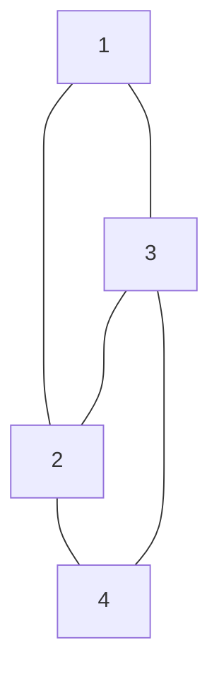

--- id: "24480"
aliases:
  - 깊이우선탐색2
tags:
  - dfs
  - graph
ref:
  - https://www.acmicpc.net/problem/24480
---

# 💳 문제이해

N개의 정점(노드)와, M개의 간선으로 구성된 무방향 그래프(undirected graph)가 
가 주어진다. 간선은 서로 연결된 정점 두개가 주어지며, 해당 정점들은
서로 다릅니다. 다 주어졌으면, 정점 R에서 시작하여 깊이 우선 탐색
(depth first search)을 사용하여 내림차순으로 탐색하여, 1부터 시작하여 N까지의
방문 순서를 출력합니다.

# 🚥 문제접근

이 문제와 비슷한 문제가 있습니다. 그 문제는 **오름차순**으로 탐색입니다.
[24479](06-DAILY/TIL/algorithm/24479.md) 

## 💡 풀이

### dfs

dfs에는 그래프/노드 트리에서 너비가 아닌 깊이를 우선하여 탐색하는 알고지름. 
이 방법은 모든 경우의 수를 탐색할 때 사용됩니다.

주어진 정점의 범위는 1\~N 입니다. 
구해야 할 값은 1\~N의 탐색 순서입니다. 즉 이미 방문한 정점(노드)는 스킵을 
통해 불필요한 메모리 사용/처리를 방지할 수 있습니다.

- 방문 여부를 기록할 배열을 준비 해줍니다.

저희 목표는 정점의 방문 순서를 구하는 것입니다.
이를 위해 각 정점이 몇 번째로 방문 하였느지 기록합니다.

해당 정점이 방문 되지 않았다면, 해당 노드의 이웃 노드들을 내림차순으로 
탐색합니다. 

위 과정을 모든 정점들이 탐색이 완료 될 때까지 반복합니다.

### graph

그래프는 2차원 배열을 사용하여 1차원 배열에는 각 1~N을 2차원 배열에는 각 
원소의 이웃 정점(노드)들을 저장합니다.


### 🖥️ source code

```c
#include<stdio.h>
#include<stdint.h>
#include<stdlib.h>

typedef struct {
    int32_t** graph;
    int32_t* visited;
    int32_t* neighbors;
    int32_t* N;
	int32_t* order;
} Graph;

int32_t compare(const void* a, const void* b) {
    return (*(int32_t*)b) - (*(int32_t*)a);
}

int32_t dfs(Graph* a, int32_t R) {
    int32_t static count = 1;
	a->order[R] = count;
    if (a->visited[R]) {
        return 0;
    }

    a->visited[R] = 1;
    qsort(a->graph[R], a->neighbors[R], sizeof(a->graph[R][0]), compare);
    count += 1;

    for (int32_t i = 0; i < a->neighbors[R]; i += 1) {
        if (!a->visited[a->graph[R][i]]) {
            dfs(a, a->graph[R][i]);
        }
    }
    return 0;    
}
int32_t main(void) {
    int32_t N, R, M;
    scanf("%d %d %d", &N, &M, &R);
    int32_t* visited = (int32_t*)calloc((N + 1), sizeof(int32_t));
    int32_t** graph = (int32_t**)malloc((N + 1) * sizeof(int32_t*));
    int32_t* neighbors = (int32_t*)calloc((N + 1), sizeof(int32_t));
	int32_t* order = (int32_t*)calloc((N + 1), sizeof(int32_t));

	for (int32_t i = 0; i <= N; i += 1) {
		graph[i] = (int32_t*)calloc(1, sizeof(int32_t));
	}
    for (int i = 0; i < M; i += 1) {
        int32_t u, v;
        scanf("%d %d", &u, &v);
        graph[u] = (int32_t*)realloc(graph[u], 
            (neighbors[u] + 1) * sizeof(int32_t));
        graph[v] = (int32_t*)realloc(graph[v], 
            (neighbors[v] + 1) * sizeof(int32_t));
        graph[u][neighbors[u]++] = v;
        graph[v][neighbors[v]++] = u;
    }
    Graph a = {
        graph,
        .visited = visited,
        neighbors,
        &N,
		order,
    };
    dfs(&a, R);
	free(graph[0]);
	for (int i = 1; i <= N; i += 1) {
		free(graph[i]);
		printf("%d\n", order[i]);
	}
	free(graph);
	free(order);
	free(visited);
	free(neighbors);
    return 0;
}
```
