# 💳 문제이해

N개의 추과 각 무게, 그리고 구슬 M개와 각 무게가 주어졌을 때, 저울을
사용해서 추를 조합하여
각 구슬의 무게가 확인이 될 경우 'Y'를 출력, 아니면 'N'를 출력하세요.

# 🚥 문제접근

```
2
1 4
2
3 2
```

- 추 개수 2개 $\neq$ 추(1)
    1. 1
    2. 4
- 구슬 개수 2개
    1. 3
    2. 2

구슬 무게 3을 확인 할 수 있는 방법은 한가지 밖에 없습니다.

- 추(1) + 구슬(3) = 추(4) 

고로 구슬 3은 무게가 3인 것을 알 수 있습니다.

하지만 2는 마땅한 경우의 수가 없습니다.

1. 구슬(2) $\neq$ 추(1) + 추(4)
2. 구슬(2) + 추(1) $\neq$ 추(4)
3. 구슬(2) + 추(4) $\neq$ 추(1)

이처럼 나올 수 있는 경우의 수 중 하나라도 해당 되는 게 없습니다.

그러면 어떻게 풀어야 할까요?

## 🤔 생각
구슬의 추를 추가하지 않으면 dfs나 bfs로 풀 수 있을 거 같은데,
구슬의 추를 넣는 경우도 생각해야 하므로 어떻게 풀어야 될지 감이 안 잡히네요.

...

지피티 말로는 dfs를 사용해서 왼쪽 저울에 추를 추가하는  경우, 오른쪽 저울에
추를 추가 하는 경우, 추를 넣지 않는 경우를 구하라고 하네요.

다른 건 알겠는데, 추를 추가하지 않는 경우는 무슨 경우일까요?

> gpt설명을 들어보니, 납득이 가네요. 

만약의 구슬의 무게가 4이면, 현재 탐색하는
추가 1g이고, 다음 탐색의  추가 4g이면, 1g의 추를 저울의 추가하지 않으므로
다음 탐색 때, 4g을 오른쪽 저울에 추가하는 경우의 수를 
통해 구슬의 무게가 4g인 것을 확인 할 수 있습니다.

구슬을 사용하지 않고 오직 추로만 사용하여 무게를 저장하는데요.

추가 1g, 4g이 있을 경우 나올 수 있는 모든 경우의 무게는

1. 1g으로 시작
    1. 왼쪽 저울에 1g을 추가하는 경우
        1. 왼쪽 저울에 4g을 추가하는 경우
            - 결과 5g을 만들 수 있습니다.
        2. 오른쪽 저울에 4g을 추가하는 경우
            - 결과 1g 과 4g의 차이는 3g을 만들 수 있습니다.
        3. 4g의 추를 사용하지 않는 경우
            - 결과 1g을 만들 수 있습니다.
    2. 오른쪽 저울에 1g을 추가한 경우
        1. 왼쪽 저울에 4g을 추가한 경우 
            - 4g - 1g = 3g은 이미 확인이 되었으므로 스킵합니다.
        2. 오른쪽 저울에 4g을 추가한 경우
            - 0g 과 5g의 차이는 5g이며, 이미 확인이 되었으므로 스킵
        3. 4g을 저울에 추가하지 않는 겨우
            - 1g 또한 확인이 되었으므로 스킵
    3. 1g을 저울에 추가하지 않는 경우
        1. 왼쪽 저울에 4g을 추가한 경우 = 4g
        2. 오른쪽 저울에 4g을 추가한 경우 = 4g
        3. 4g을 추가하지 않는 경우 = 0g
    
2. 4g으로 시작해도
    나오는 경우의 수는 같습니다.

위와 같이 각 무게의 추를 왼쪽, 오른쪽 저울에 추가하는 경우의 수와, 추가하지 않는
경우의 수를 dfs 형식으로 작성할 수 있습니다.

하지만 추의 길이마다 나올 수 있는 경우의 수는 다릅니다.
그래서 무조건 해당 무게가 방문 되었다고 건너뛰는 것이 아닌, 해당 길이에서
해당 무게가 이미 탐색이 되었다면, 건너뛰는 것이 맞습니다.

1, 2, 100인 경우

1. 왼쪽 1; 현재 무게: 1
    1. 2를 왼쪽 현재 무게: 1 + 2 = 3
        1. 100을 왼쪽 현재 무게: 1 + 2 + 100 = 103
        2. 100을 오른쪽 현재 무게: 1 + 2 - 100 = 97 
        3. 100을 넣지 않음 현재 무게: 1 + 2 = 3
    2. 2를 오른쪽 현재 무게: 1 - 2 = 1

> 이 부분에서 무게 1은 위에 이미 확인이 된 상태입니다. 그러면 건너뛰어야 할까요?
더 보겠습니다.
1.
    2.
        1. 100을 왼쪽 현재 무게: 1 - 2 + 100 = 99
        2. 100을 오른쪽 현재 무게: 1 - (2 - 100) = 101
        3. 100을 안 넣음: 1 - 2 = 1

    3. 2를 안 넣음 현재 무게: 1 
        1. 100을 왼쪽 현재 무게: 1 + 100 = 101
        2. 100을 오른쪽 현재 무게: 1 - 100 = 99
        3. 100을 안 넣음 현재 무게: 1

위에처럼 첫 번째 무게에서 1이 확인이 되었더라도, 두 번째 길이에서 1은 다른
경우의 수를 창출 할 수 있습니다. 101, 99와 같은 말이죠.

반대로 두 번째 길이에서 다시금 1이 나왔으면, 건너뛰어도 되죠, 101과 99가 
중복으로 나오시는 걸 보실 수 있습니다.

## 💡 문제풀이

1. dfs

```mermaid
flowchart TD
isweightAlready{"if 무게가 이미 확인이 현재 원소(길이) 되었다면"}
weightAlready["스킵"]
isAllWeight{"if 모든 추을 탐색했으면"}
AllWeight["추료"]
dfsLeft["왼쪽 저울에 새로운 추의 무게를 추가하는 경우"]
dfsRight["오른쪽 저울에 새로운 추의 무게를 추가하는 경우"]
dfsNot["추을 추가하지 않는 경우"]

isweightAlready -- true --> weightAlready
isweightAlready -- false --> isAllWeight
isAllWeight -- true --> AllWeight
isAllWeight -- false --> dfsLeft
dfsLeft --> dfsRight --> dfsNot
```



### 🖥️ source code
```c
#include<stdio.h>
#include<stdint.h>
#include<stdlib.h>

#define difference(a, b)((a) > (b) ? (a) - (b) : (b) - (a))

typedef struct {
    int32_t* length;
    int32_t* weights;
	_Bool** dp;
    int32_t current_weight;
    int32_t idx;
} Weight;

void dfs(Weight a) {
    if (a.dp[a.idx][a.current_weight] == 1) {
        return;
    }
	a.dp[a.idx][a.current_weight] = 1;

    if (*a.length == a.idx) {
        return;
    }

	Weight left = {
		a.length, a.weights, a.dp, a.current_weight + *(a.weights + a.idx), a.idx + 1
	};

	Weight right = {
		a.length, a.weights, a.dp, difference(a.current_weight, *(a.weights + a.idx)), a.idx + 1
	};

	Weight not = {
		a.length, a.weights, a.dp, a.current_weight, a.idx + 1,
	};

	dfs(left);
	dfs(right);
	dfs(not);

    return;
}
void input_arr(int32_t* arr, int32_t length) {
    for (int i = 0; i < length; i += 1) {
        scanf("%d", &arr[i]);
    }
    return;
}

int32_t main(void) {
	int32_t N;
	scanf("%d", &N);
	int32_t weights[N];
	input_arr(weights, N);

	int32_t sum = 0;

	for (int32_t i = 0; i < N; i += 1) {
		sum += weights[i];
	}

	_Bool **dp;
	dp = (_Bool**)malloc((N + 1) * sizeof(_Bool*));
	for (int i = 0; i < N + 1; i += 1) {
		dp[i] = (_Bool*)calloc((sum + 1), sizeof(_Bool));
	}

	Weight a = {
		.current_weight = 0,
		.weights = weights,
		.dp = dp,
		.idx = 0,
		.length = &N,
	};

	dfs(a);

	// printf("\n");
	// for (int i = 0; i < sum; i += 1) {
	// 	printf("%d v:%2d;", a.dp[i], i);
	// 	if (i % 10 == 9) {
	// 		printf("\n");
	// 	}
	// }
	//
	// printf("\n");
	//

	int32_t M;
	scanf("%d", &M);
	int32_t balls[M];
	input_arr(balls, M);

	for (int32_t i = 0; i < M; i += 1) {
		if (balls[i] <= sum && dp[N][balls[i]] == 1) {
			printf("Y ");
		} else {
			printf("N ");
		}
	}
	for (int32_t i = 0; i < N; i += 1) {
		free(a.dp[i]);
	}
	free(a.dp);
    
    return 0;
}
```
