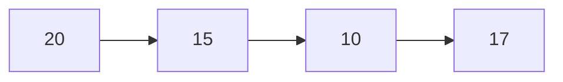
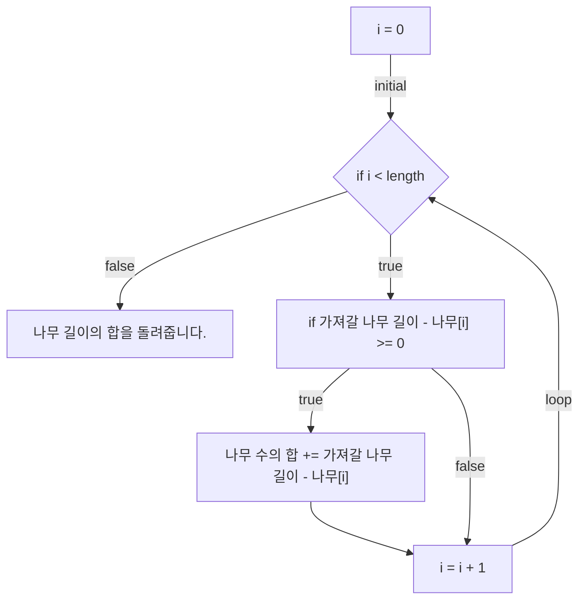

# 💳 문제이해

N개의 나무가 주어졌을 w때, 상근이는 최소 길이의 나무를 가져 것입니다.
이 때 각 나무의 길이/높이가 주어졌을 때 특정 높이부터 맨 꼭대기의
나무를 자를 때, 최소한의 나무만 자를 수 있게 최대 높이를 
구하세요.

# 🚥 문제접근

가져갈 나무의 길이가 최대 20억이네요. 상근이 욕심쟁이네요. 
최대 높이에서 하나식 빼가며 자르는 방법은 M^나무 개수 만큼 시간이 걸리므로
매우 비효율적입니다. 따라서 이분 탐색을 사용하여, 절반식 줄여가며
탐색할 계획입니다. $log_2M$ 만큼의 시간 복잡도로 문제를
풀 수 있게 됩니다.

## 예시:

- 나무의 개수: 4개
- 가져갈 나무의 길이: 7



나무 M길이를 가져잘 수 있게, 최대 옾이를, 각 원소(나무)의 길이를 빼서 
자른 나무의 길이를 합해서 가져갈 나무의 길이와 합이 같으면, 프로그램 종료,
아니면 가져갈 나무의 길이가 될 때까지 현재 나무의 길이를 1식 뺍니다.

1식 더하면 탐색 범위가 현저히 작으므로
시작 길이와 끝에 길이를 2로 나눕니다, 즉 절반의 값의 범위를 탐색을 합니다.

각 원소(나무)의 길이의 현재 길이의 뺀 값이 가져갈 나무의 길이가 맞는지,
확인하는 로직을 먼저 짭니다.

## 💡 문제풀이방법

### 1. 자를 수 있는 나무 길이 구학기


#### 예시
- 나무 개수: 4개
- 현재 나무길이: 15

1. 현재나무길이: 20; 합계: 5
2. 현재나무길이: 15; 합계: 5
3. 현재나무길이: 13; 합계: 5
4. 현재나무길이: 17; 합계: 7

위에 순서처럼, 15 길이 이상은 20, 17을 뺀 7개를 얻을 수 있습니다.


### 2. 이분 탐색 

```mermaid
flowchart TD

if_root{"if start_length <= end_length"} 
return["필요한 길이를 자를 수 있는 최대 높이를 돌려줍니다."]
mid["중간 값 = (start_length + end_length) / 2"]
current_length_sum["현재 길이 합계 = 중간 값을 모든 나무의 잘라서 나오는 나무의 길이"]
necessary{"if 현재 길이 합계가 >= 필요한 길이"}
increase["시작 길이의 절반 + 1을 할당합니다.<br>중간 값을 현재 최대 길이로 저장합니다."]
decrease["끝에 길이의 절반 - 1을 할당합니다."]

if_root -- false --> return 
if_root -- true --> mid
mid --> current_length_sum --> necessary
necessary -- false --> decrease -- loop --> if_root
necessary -- true --> increase -- loop --> if_root
````

시작 값(길이)에 중간 값을 더하는 범위를 좁히려는 의도이지만, 1은 왜 더할까요?

```
시작 길이: 15; 끝나는 길이: 16; 중간 값: 15
시작 길이: 15; 끝나는 길이: 16; 중간 값: 15
시작 길이: 15; 끝나는 길이: 16; 중간 값: 15
```

위와 같은 무한 루프를 경우를 방지하기 위함입니다. 필요한 나무 길이가 만족
되었을 경우
15와 16을 더한 절반 값은 소수점을 버리면 15가 됩니다. 이는 시작 값에 
15를 할당하면 위와 같은 작업이 반복적으로 실행되게 됩니다.

이를 방지하기 위해 1을 더해줍니다.

반대로 끝나는 길이에 왜 1을 빼줄까요?
첫번째 길이와 마찬가지인 이유입니다.
```

```
시작 길이: 16; 끝나는 길이: 16; 중간 값: 16 시작 길이: 16; 끝나는 길이: 16; 중간 값: 16
시작 길이: 16; 끝나는 길이: 16; 중간 값: 16

필요한 나무 길이가 만족하지 않았을 경우,
중간 값(길인)이 끝나는는 길이에 할당됩니다.
이는 16을 16을 더한 절반 값인 16을 반복적으로 끝나는 길이에 반복하면서,
벗어 날 수 없기 때문에 마이너스 1을 주어 반복문을 종료합니다.

종료 조건이 시작 길이 > 끝나는 길이 인 이유는

```
4 7
20 15 10 17
시작 길이: 11; 끝나는 길이: 20; 중간 값: 10
시작 길이: 16; 끝나는 길이: 20; 중간 값: 15
시작 길이: 16; 끝나는 길이: 17; 중간 값: 18
시작 길이: 16; 끝나는 길이: 15; 중간 값: 16
```
같은 전제가 주어졌을 때, 중간 길이인 16은 필요한 나무 길이의 개수를 
만족하지 않으므로, 1을 빼고 끝나는 길이의 할당됩니다. 그러면 15가 되는데요.

16가 15를 더한 절반 값은 15입니다. 이는 조건의 만족하므로 1을 더한 값을 
시작 길이의 할당합니다. 그러면 위와 같은 전제가 반복 됩니다.
그러므로 시작길이가 끝나는 길이보 길고, 마지막으로 조건을 만족하는 중간 값을
돌려줍니다.

반복문의 종료 조건이 시작길이와 끝나는 길이가 같은 경우는, 필요 나무 길이를
만족할 경우 1을 더해주어야 루프에 빠지지 않습니다. 그러면 절반으로 나눌 때,
1을 더해줍니다. 만족하지 않을 경우 1을 빼주지 않으면, 똑같이 루프에 빠집니다.
그럼으로 만족하지 않으면 1을 빼줍니다. 만족하지 않을 경우는 1을 더한다는
전제하에 일어남으로 상관 없습니다.

- 시작 길이: 16; 끝나는 길이: 17; 중간 값: 18

그럼 위와 똑같은 전제로 다시 실행해보겠습니다.
중간 값은 조건을 만족하지 않으므로 1을 뺀 값을 끝나는 길이에 할당하여 17이 
됩니다. 여기서 (16 + 17 + 1) / 2은 17이므로 마찬가지로 조건을 만족하지 않으므로
1을 빼고 끝나는 길이에 할당합니다. 그러면 시작 길이와 끝나는 길이가 같으므로
반복문이 종료됩니다. 그리고 마지막으로 할당된 시작 길이의 값이 최대 길이가 됩니다.

결론적으로, (a + b) / 2의 값이 a이거나 b일 경우 탐색할 범위가 이제 없다는 것을 
의미합니다. 하지만 a 와 b의 값이 서로 다를 경우, 절반 값이 만족 될 경우 1을 
더함으로 a값이 b보다 커져 버립니다.
첫번째 방법에 종료 조건이기도 하고요. 만족하지 않을 경우 b - 1 값이 b에 할당됩니다.
이를 방지하기 위해 조건을 만족하면 1을 더해서 a에 할당하는게 아니라,
ㅈ러반을 나누는 조건에 1을 더한다는 전제를 깔면,
(a + b + 1) / 2를 구하는 과정에서 1을 더해주면 b는 a와 같아집니다.

이는 a 와 b가 서로 동일한 값으로 이어집니다. 탐색할 범위가 이제 없기 때문에,
a나 b를 반환하고 종료합니다.

#### 예시
- 나무 길이: 4개
- 필요한 나무 길이: 7
- 나무 길이들: 20, 15, 10, 17

1. 길이 합계: 22; 현재 최대 길이: 10
2. 길이 합계:  7; 현재 최대 길이: 15
3. 길이 합계:  2; 현재 최대 길이: 18
4. 길이 합계:  5; 현재 최대 길이: 16

필요한 나무 길이를 만족하는 경우는 길이가 15 랑 10입니다.
15가 10보다 큼으로 15가 필요한 나무 길이 구할 수 있는 최대 나무 길이입니다.

