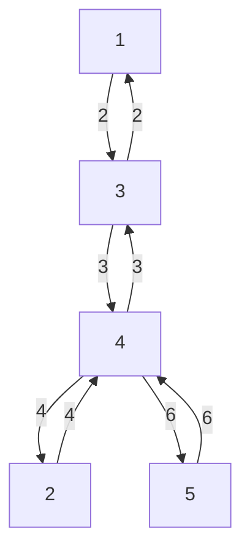

# 💳 문제 이해

정점의 개수 `N`이 주어집니다. 간선도 함께 주어집니다.
서로 가장 먼 두 정점을 구하시오.

# 🚥 접근

서로 가장 멀다는 기준은 가중치라고 생각합니다.
두 정점 중 서로 가장 먼 정점을 찾는다고 하면,

## 🌏 풀이

**예시**:



위 트리에서 최장 경로를 가지는 두 정점은 1과 5입니다.

- 1 -> 3 -> 4 -> 5
- 2 + 3 + 6 = 11 가중치

다익스트라를 사용한다고 해도 시작 노드가 절대적인 게 아니라서
적절하지 않은 것 같습니다.

시작 노드가 정해지지 않았으니 어떤 정점을 기준으로 가장 먼 정점을 찾습니다.
하지만 그 거리 중 가장 긴 거리라고 할 수는 없습니다. 왜냐하면 역 경로, 즉
양방향이기 때문입니다.

따라서 어떤 정점을 기준으로 가장 먼 정점을 구한다면, 그 정점에서 다시 가장 먼
거리를 구해야 합니다.

이게 한 방향이라면, 첫 번째 방법으로 해결이 가능하나, 
양방향이기 때문에 자신이 다음으로 오는 경로의 가중치를 고려해야 합니다.

- 1 -- 3 --> 5
- 5 -- 10000 --> 1

무난하게 `BFS`/`DFS`로 구할 수 있을 것 같습니다.

### 🛠️ 풀이

#### 🖥️ source code

```cpp
#include <iostream>
#include <sys/types.h>
#include <vector>
#include <queue>

using namespace std;

struct Edge {
    int64_t vert; 
    int64_t weig; 
};

struct Distance_n_Vertex {
    int64_t weig; 
    int64_t vert; 
};

typedef vector<vector<Edge>> Adj_list;

struct Graph {
    Adj_list al;
    int32_t size;
};

Distance_n_Vertex BFS(Graph& g, int64_t start) { 
    vector<int32_t> visited(g.size, 0);
    vector<int64_t> distance(g.size, 0); 
    queue<int32_t> q;
    q.push(start);
    visited[start] = 1;
    distance[start] = 0;

    Distance_n_Vertex max_dest = { 0, start };

    while (!q.empty()) {
        int32_t cur_src = q.front();
        q.pop();

        for (int32_t i = 0; i < g.al[cur_src].size(); i += 1) {
            int64_t adj_vert = g.al[cur_src][i].vert; 
            int64_t adj_weig = g.al[cur_src][i].weig; 
            if (visited[adj_vert] == 0) {
                visited[adj_vert] = 1;
                distance[adj_vert] = distance[cur_src] + adj_weig;
                q.push(adj_vert);
                if (distance[adj_vert] > max_dest.weig) {
                    max_dest = { distance[adj_vert], adj_vert};
                }
            }
        }
    }

    return max_dest;
}

int32_t solution(Graph g) {
    auto [longest_dist_a, a] = BFS(g, 1);
    auto [longest_dist_b, _] = BFS(g, a);
    cout << longest_dist_b << '\n';
    return 0;
}

int32_t main(void) {
    int32_t N;
    cin >> N;
    Graph g = {
        .size = N + 1,
    };
    g.al.resize(N + 1);
    for (int32_t i = 0; i < N; i += 1) {
        int64_t src, weight, dest = 0; 
        cin >> src;
        while (dest != -1) {
            cin >> dest;
            if (dest == -1) break;
            cin >> weight;
            g.al[src].push_back({dest, weight});
        }
    }

    solution(g);
    return 0;
}
```
