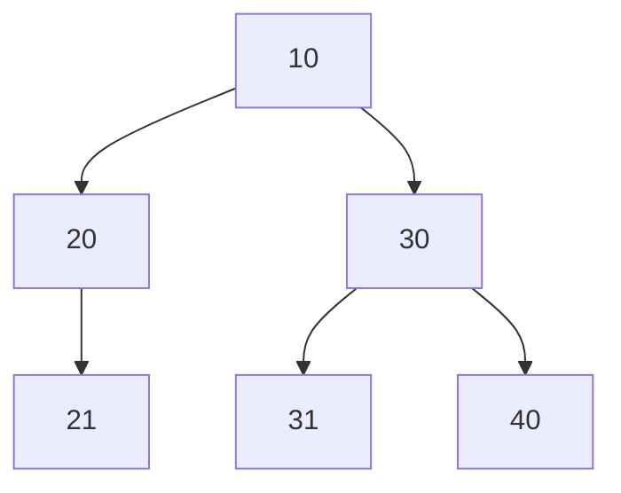

# 💳 문제이해

1부터 V번의 정점과 E개의 간서으로 이루어진 방향 그래프가 주어집니다.
방향은 일반통행, 한 방향입니다. 그리고 각 가중치는 10이하의 랜덤
자연수입니다. 1부터 각 정점의 번호의 도달할 수 있는 최단 거리를
출력하시오.

# 🚥 문제접근

가중치가 서로 동일하지 않기 때문에, `BFS` 알고리만으로는 최단 경로를 탐색하기에는
어려울 것 같습니다. 이를 위해 `Dijkstra` 알고리즘을 통해 각 번호의 1부터
사이의 최단 거리를 구할 수 있을 것 같습니다.

## 🌏 분석

### 💿 Dijkstra(다익스트라)

해당 알고리즘은 모든 가중치가 양의 정수일 경우 효율적으로 정점 사이의 
최단 거리를 구할 수 있습니다.

이는 먼저 들어오는 정점을 처리하는 방식으로 추가적으로 해당 정점의 인접한
정점의 가중치를 비교합니다. 저도 처음으로 사용하는 거라서 우선 구현해보면서
테스트 해보겠습니다.

### ⤴️  heap(prior queue)

원소들을 효과적으로 실시간으로 정렬해주는 자료 구조입니다. `tree-base`형 
구조로 부모 노드와 자식 두 개를 가지고 있습니다. 부모 노드는 자식 노드보다
크거나 작아야 합니다(루트가 최소값일 경우). 위 조건을 만족하면
자식 노드위에 취치는 상관 없습니다. 왼쪽에 있든지 오른쪽에 있든지,



```c
#include<stdio.h>
#include<stdlib.h>
#include<stdint.h>

#define INF (0xFFFFFFFF >> 1)
#define POW(x, num) (2 << (num))

typedef struct Data {
    int32_t order;    
    int32_t weight;
} Data;

typedef struct heap {
    int32_t size;
	int32_t top;
	int32_t bottom;
	int32_t capacity;
	Data* arr;
} heap;

heap* create_heap(int32_t N) {
	heap* n = (heap*)malloc(sizeof(heap));
	n->size = 0;
	n->top = 0;
	n->bottom = 0;
	n->capacity = N;
	n->arr = (Data*)malloc(N * sizeof(Data));
	return n;
}

void swap(Data* a, Data* b) {
    Data temp = *a;
    *a = *b;
    *b = temp; 
    return;
}

void heapify_up(heap* h) {
	int32_t bottom = h->bottom;
	int32_t parent = (bottom - 1) / 2;

    while (bottom >= 0) {
        if (h->arr[parent].weight > h->arr[bottom].weight) {
            swap(&h->arr[parent], &h->arr[bottom]);
        } else {
			return;
		}
        bottom = parent;
        parent = (bottom - 1) / 2;
    }
	return;
}

heap* heapify_down(heap* h) {
    int32_t cur = h->top;

	while ((cur * 2 + 1) < h->size) {
		int32_t min = cur;
		int32_t changed = 0;

		if ((min * 2 + 1) < h->size && h->arr[min * 2 + 1].weight < h->arr[min].weight) {
			min = (min * 2 + 1);
			changed = 1;
		}
		if ((min * 2 + 2) < h->size && h->arr[min * 2 + 2].weight < h->arr[min].weight) {
			min = (min * 2 + 2);
			changed = 1;
		}
		if (changed == 1) {
			swap(&h->arr[cur], &h->arr[min]);
		} else {
			return h;
		}
		cur = min;
	}
    return h;
}

heap* insert_node(Data val, heap* h) {
	if (h->capacity == h->size) {
		printf("full");
		exit(1);
	}
    if (h->size == 0) {
		h->arr[h->top] = val;
		h->size += 1; 
    } else {
		h->bottom += 1;
		h->arr[h->bottom] = val;
		h->size += 1;
		heapify_up(h);
    }
		
    return h;
}

Data remove_heap(heap** h) {
	Data min = { .order = -1, .weight = INF };
	if ((*h)->size == 0) return min;
	
	min = (*h)->arr[(*h)->top];

	int32_t bottom = (*h)->bottom;
	swap(&(*h)->arr[(*h)->top], &(*h)->arr[bottom]);
	(*h)->size -= 1;
	if ((*h)->bottom > 0)(*h)->bottom -= 1;
	heapify_down(*h);
	return min;
}

typedef struct Node {
	Data val;
	struct Node* next;
} Node;

typedef struct Graph {
	int32_t size;
	Node** adjacent_list;
} Graph;

Graph* create_graph(int32_t n) {
	Graph* g = (Graph*)malloc(sizeof(Graph));
	g->size = n;
	g->adjacent_list = (Node**)malloc(sizeof(Node*) * n);
	for (int32_t i = 1; i < n; i += 1) {
		*(g->adjacent_list + i) = NULL;
	}
	return g;
}

Node* create_node(Data val) {
	Node* new = (Node*)malloc(sizeof(Node));
	new->next = NULL;
	new->val = val;
	return new;
}

void add_edges(Graph* g, int32_t src, int32_t dest, int32_t weight) {
	Data dest_val = { .weight = weight, .order = dest };
	Node* dest_node = create_node(dest_val);
	dest_node->next = g->adjacent_list[src];
	g->adjacent_list[src] = dest_node;
	return;
}

void print_dijkstra(Graph* g, int32_t start) {
	int32_t dist[g->size];
	for (int32_t i = 1; i < g->size; i += 1) {
		dist[i] = INF;
	}
	dist[start] = 0;

	heap* h = create_heap(300005);
	Data d = { .weight = 0, .order = start };
	h = insert_node(d, h);

	while (h->size > 0) {
		Data cur = remove_heap(&h);	
		// printf("order: %d; weight: %d\n", cur.order, cur.weight);

		Node* adj = g->adjacent_list[cur.order];
		while (adj != NULL) {
			if (dist[adj->val.order] > dist[cur.order] + adj->val.weight) {
				dist[adj->val.order] = dist[cur.order] + adj->val.weight;
				Data adj_d = { .weight = adj->val.weight + dist[cur.order], 
					.order = adj->val.order };
				h = insert_node(adj_d, h);
			}
			adj = adj->next;
		}
	}

	for (int32_t i = 1; i < g->size; i += 1) {
		if (dist[i] == INF) {
			printf("INF\n");
		} else {
			printf("%d\n", dist[i]);
		}
	}
}

int32_t main(void) {
	int32_t V, E;
	scanf("%d %d", &V, &E);
	int32_t start;
	scanf("%d", &start);

	Graph* g = create_graph((V + 1));
	for (int32_t i = 0; i < E; i += 1) {
		int32_t u, v, w;
		scanf("%d %d %d", &u, &v, &w);
		add_edges(g, u, v, w);
	}
	heap* h = create_heap(20);
	// for (int32_t i = 10; i > 1; i -= 1) {
	// 	Data val = {.weight = i, .order = i};
	// 	h = insert_node(val, h);
	// }
	//
	// for (int32_t i = 0; i < 9; i += 1) {
	// 	Data val = remove_heap(&h);
	// 	printf("%2d ", val.order);
	// }
	print_dijkstra(g, start);

	return 0;
}
```
