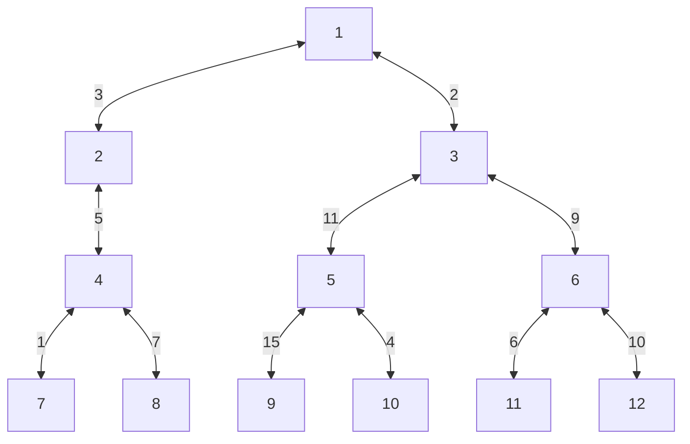

# 💳 문제 이해

정점 개수 `N`이 주어집니다. 무방향 그래프와 가중치와 간선이 주어질 때,
트리의 지름, 가중치가 가장 긴 길이를 가지는 두 정점 사이의 길이를 구하시오.

# 🚥 문제 접근

선행 문제: [트리 반지름](06-DAILY/TIL/algorithm/baekjoon/1167.md)

두 정점 사이의 최장 길이를 구하는 문제입니다.
트리 탐색 방법인 `BFS/DFS`를 사용합니다. 어차피 모든 정점을 탐색하기 
때문에 두 개 중에 무엇을 사용해도 상관 없습니다.

이전에 `BFS`를 사용했습니다. 이번엔 `DFS`를 사용합니다.

## 🌏 분석

보통 최단 거리를 구할 때 가중치가 0이 아닌 경우 `Dijkstra` 같은 알고리즘을
사용할 텐데, 어째서 `BFS`나 `DFS`를 사용할 수 있을까요?

우선 자료 구조는 `Graph`가 아니라 `Tree`입니다.

1. `Graph`는 연결되는 정점이 순환이 가능합니다.
2. `Tree`는 연결되는 정점이 순환이 가능하지 않습니다.

즉, 어떤 정점과 다른 정점의 경로는 하나밖에 없습니다.



위 `Tree`에서 정점 2번과 정점 9번 사이의 경로는 하나밖에 없습니다.
- 2 → 1 → 3 → 5 → 9

자료가 위와 같다면, 가장 긴 길이를 가지는 경우를 전체 탐색 한 번으로
구할 수 있습니다. 다른 경우가 없기 때문에,

- 2부터 9까지의 가장 긴 길이는 하나입니다.

2부터 9 사이의 길이를 구하였습니다. 하지만 과연, 해당 길이가
트리에서 두 정점 사이의 가장 긴 길이일까요? 아니요, 더 긴 
길이가 존재합니다. 바로 9와 12 사이입니다. 

그러니 한 번만 탐색하지 않고, 정점 9의 가장 긴 길이를 가지는 정점과의
거리를 구해야 합니다. 원리는 모르겠지만, 9와 12 사이의 가중치가 높습니다.

만약에 2가 9와 11을 둘 다 거치면 한 번만 탐색해서 구할 수 있습니다. 하지만,
순환이 안 되는 트리이기 때문에 불가능합니다. 

### 🛠️ 풀이

#### 🖥️ source code

```cpp
#include <iostream>
#include <vector>
#include <stack>

using namespace std;
struct Weight_vertex {
    int32_t weig;
    int32_t vert;
};

typedef vector<vector<Weight_vertex>> Adj_list;

Weight_vertex DFS(Adj_list& al, int32_t start) {
    stack<int32_t>  st;
	Weight_vertex max = { 0, start };
	vector<int32_t> visited(al.size(), 0);
	vector<int32_t> distance(al.size(), 0);
	visited[start] = 1;
	st.push(start);
	
	while (!st.empty()) {
		int32_t src = st.top();
		st.pop();

		for (int32_t i = 0; i < al[src].size(); i += 1) {
			int32_t dest_w = al[src][i].weig;
			int32_t dest_v = al[src][i].vert;
			
			if (visited[dest_v] == 0) {
				distance[dest_v] = distance[src] + dest_w;
				visited[dest_v] = 1;
				st.push(dest_v);
				
				if (max.weig < distance[dest_v]) {
					max = { distance[dest_v], dest_v };
				}
			}
		}
	}

	return max;
}

int32_t solution(Adj_list al) {
	auto [longest_weight_a, a] = DFS(al, 1);
	auto [longest_weight_b, _] = DFS(al, a);
	cout << longest_weight_b << '\n';
	return 0;
}

int32_t main(void) {
    int32_t N;
    cin >> N;

	Adj_list al(N + 1);
	
	while (N -= 1) {
		int32_t src, dest, weig;
		cin >> src >> dest >> weig;

		al[src].push_back({weig, dest});
		al[dest].push_back({weig, src});
	}	

	solution(al);
    
    return 0;
}
```
