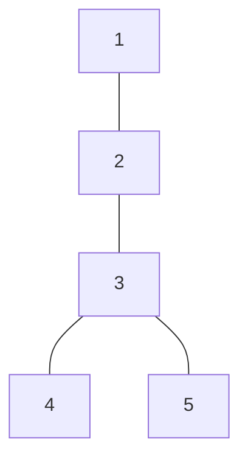

# 💳 문제이해

양방향 그래프가 주어집니다. 목적지 후보가 주어졌을 때,
불가능한 경우를 제외하고, 어떤 `s` 지점에서 시작했을 도착할 수 있는
목적지 후보들를 오름차순으로 출력하세요

## 🚥 문제접근

우선 잘 이해가 안 되니 시각화를 해봅니다.


- 출발은 5에서 출발했습니다.
- 2와 3 사이를 지나갔습니다.
- 2와 3을 지나가면 4와 5를 갈 수 있습니다.
- 고로 도착할 수 있는 후보는 4 와 5입니다.

유의해야 할 것은 그들은 딴길로 우회하지 않고 목적지로 곧장 간다는
간다는 점입니다.

### 🌏 분석

최단 경로를 구하는 문제는 조건의 따라서 다른 알고리즘이 사용됩니다.
가중치가 서로 동일하다면 `BFS`가 적절합니다. 

또는 가중치가 양의 정수인경우 `dijkstra`(다익스트라)쓰인다고 합니다.

#### 🛠️ 풀이

이 문제에 핵심은 **우회하지 않고 최단 경로를 통해 목적지에 도달**
한다는 것입니다. 이 구문이 시사하는 목적은 g-h를 통해 목적지에 도달한
경로가 최단 경로일 경우에만 조건이 총족됩니다.

즉슨, 시작지점과 목적지 사이에 최단 거리가 시작지점과 g-h와 목적지 사이에
최단 거리가 서로 동일해야 한다는 소리입니다.

- 시작점->목적지의 최단 거리
- 시작점->g->h->목적지 **혹은** 시작점->h->g->목적지

위 두 최단 거리가 같아야 조건이 총족합니다.

`dijkstra`알고리즘을 통해 시작점에서 목적지, g에서 목적지, h에서 목적지
사이에 최단 경로를 구합니다.

##### 🖥️ source code

```cpp
#include <stdlib.h>
#include<iostream>
#include<stdint.h>
#include<queue>
#include<functional>
#include<vector>

#define INF (0x7FFFFFFF)
#define CUR_DISTANCE(id) distance[id->val.dst]
#define NEXT_DISTANCE(dt) distance[dt.dst]

typedef struct Data {
	int32_t dst;	
	int32_t weight;

	Data(int32_t v, int32_t u) : dst(v), weight(u) {}

    bool operator>(const Data& other) const {
        return this->weight > other.weight;
    }
} Data;

struct Node {
	Node* next;
	Data val;
};

struct Graph {
	int32_t size;
	Node** adjacent_list;
};

int32_t compare(const void* a, const void* b) {
	return *(int32_t*)a - *(int32_t*)b;
}

int32_t* dijkstra(Graph* g, int32_t start) {
	std::priority_queue<Data, std::vector<Data>, std::greater<Data>> pq;
	pq.push(Data(start, 0));
	int32_t* distance = (int32_t*)malloc(g->size * sizeof(int32_t));

	for (int32_t i = 0; i < g->size; i += 1) {
		distance[i] = INF;
	}
	distance[start] = 0;

	while (!pq.empty()) {
		Data cur = pq.top();
		pq.pop();

		Node* temp = *(g->adjacent_list + cur.dst);
		while (temp != NULL) {
			if (distance[temp->val.dst] > distance[cur.dst] + temp->val.weight) {
				distance[temp->val.dst] = distance[cur.dst] + temp->val.weight;
				pq.push(Data(temp->val.dst, distance[temp->val.dst]));
			}
			temp = temp->next;
		}
	}
	return distance;
}

Graph* create_graph(int32_t size) {
	Graph* g = (Graph*)malloc(sizeof(Graph));
	g->adjacent_list = (Node**)malloc(size * sizeof(Node*));
	g->size = size;
	for (int32_t i = 0; i < size; i += 1) {
		g->adjacent_list[i] = NULL;
	}
	return g;
}

Node* create_node(Data val) {
	Node* n = (Node*)malloc(sizeof(Node));
	n->val = val;
	n->next = NULL;
	return n;
} 

int32_t add_edges(Graph *g, int32_t src, int32_t dst, int32_t weig) {
	Node* dst_n = create_node(Data(dst, weig));
	dst_n->next = g->adjacent_list[src];
	g->adjacent_list[src] = dst_n;

	Node* src_n = create_node(Data(src, weig));
	src_n->next = g->adjacent_list[dst];
	g->adjacent_list[dst] = src_n;

	return 0;
} 

int32_t solution() {
	int32_t V, E, num_target;
	scanf("%d %d %d", &V, &E, &num_target);
	int32_t start, passed1, passed2;

	scanf("%d %d %d", &start, &passed1, &passed2);
	int32_t* targets = (int32_t*)calloc(num_target, sizeof(int32_t));
	

	Graph* g = create_graph((V + 1));

	for (int32_t i = 0; i < E; i += 1) {
		int32_t u, v, w;
		scanf("%d %d %d", &u, &v, &w);
		add_edges(g, u, v, w);
	} 

	for (int32_t i = 0; i < num_target; i += 1) {
		scanf("%d", targets + i);
	}

	int32_t* distance_from_start = dijkstra(g, start);
	int32_t* distance_from_passed1 = dijkstra(g, passed1);
	int32_t* distance_from_passed2 = dijkstra(g, passed2);
	int32_t passed1_passed2 = distance_from_passed1[passed2];

	qsort(targets, num_target, sizeof(int32_t), compare);
	for (int32_t i = 0; i < num_target; i += 1) {
		int32_t target = targets[i];
		int32_t shortest_path = distance_from_start[target];
		int32_t path1 = distance_from_start[passed1] + passed1_passed2 +
			distance_from_passed2[target];
		int32_t path2 = distance_from_start[passed2] + passed1_passed2 +
			distance_from_passed1[target];
		printf("Target: %d; shortest_path: %d, path1: %d, path2: %d\n", target,
				shortest_path, path1, path2);

		if (path1 == shortest_path || path2 == shortest_path) {
			printf("%d ", target);
		}
	}
	printf("\n");
	return 0;
}

int32_t main(void) {
	int32_t T;
	scanf("%d", &T);
	for (int32_t i = 0; i < T; i += 1) {
		solution();
	}
    return 0;
}
```
